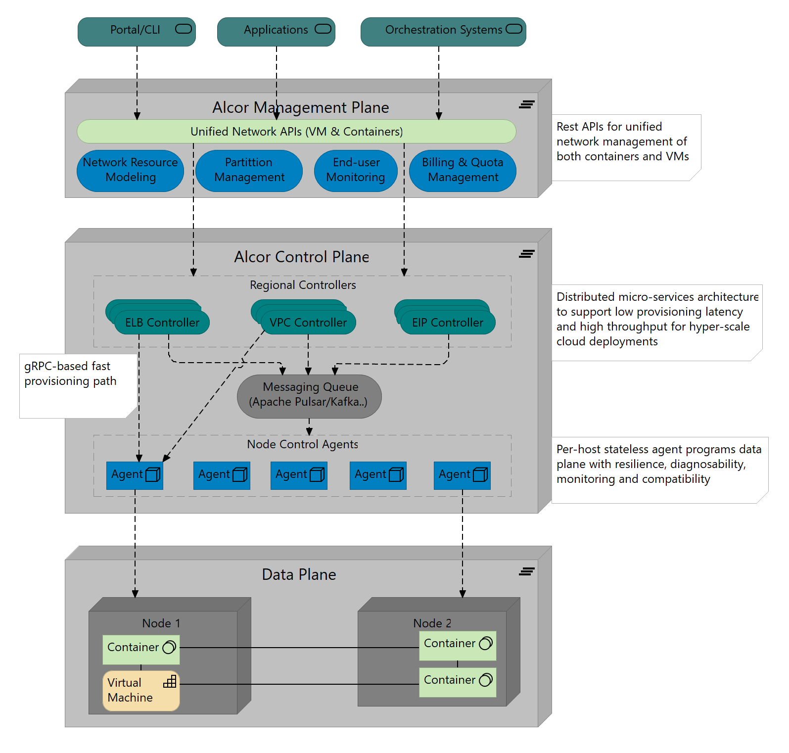

# Alcor
A Hyperscale Cloud Virtual Networking System

* For information about how to use Alcor, visit [Getting Started](src/README.md)
* To ask questions, raise feature requests and get assistance from our community, visit [Issues page](https://github.com/futurewei-cloud/Alcor/issues)
* To find many useful documents, visit our [Wiki](https://github.com/futurewei-cloud/Alcor/wiki).
For example, [Kubernetes cluster setup guide with Mizar-MP](https://github.com/futurewei-cloud/mizar-mp/wiki/K8s-Cluster-Setup-Guide-with-Mizar-MP)
shows how to use Mizar-MP for Kubernetes container network provisioning.

In this README:

- [Introduction](#introduction)
- [Repositories](#repositories)

## Introduction
Cloud computing means scale and on-demand resource provisioning.
As more enterprise customers migrate their on premise workloads to the cloud,
the user base of a cloud provider could grow at a rate of 10X in just a few years.
This will require a cloud virtual networking system with a more scalable and extensible design.
As a part of the community effort,
Alcor is an open-source cloud native platform that provides high availability, high performance, and large scale
virtual networking control plane and management plane at a high resource provisioning rate.

Alcor leverages the latest SDN and container technologies as well as an advanced distributed system design to
support deployment, configuration and scale-out of millions of VM and containers.
It is built based on a distributed micro-services architecture with a uniform way to secure, connect, and monitor
control plane micro-services,
and fine-grained control of service-to-service communication including load balancing, retries, failovers, and rate limits.
Alcor also offers a way to unify VM and container networking management,
and ensures ultra-low latency and high throughput due to its
application aware fast path when provisioning containers and serverless applications.

The following diagram illustrates the high-level architecture of Alcor control plane.

Detailed design docs:

- [Alcor high level design](/docs/visionary_design/table_of_content.adoc)
- [Alcor regional controllers](/docs/visionary_design/controller.adoc)
- [Alcor control agent](https://github.com/futurewei-cloud/AlcorControlAgent/blob/master/docs/design.adoc)

## Repositories
The Alcor project is divided across a few GitHub repositories.

- [alcor/alcor](https://github.com/futurewei-cloud/Alcor):
This is the main repository of Alcor Regional Controller that you are currently looking at.
It hosts controllers' source codes, build and deployment instructions, and various documents that detail the design of Alcor.

- [alcor/alcorcontrolagent](https://github.com/futurewei-cloud/AlcorControlAgent):
This repository contains source codes for a host-level stateless agent that connects regional controllers to the host data-plane component.
It is responsible for programming on-host data plane with various network configuration for CURD of _VPC, subnet, port, Security group etc._,
 and monitoring network health of containers and VMs on the host.

- alcor/integration (Coming soon)

As a reference, Alcor supports a high performance cloud data plane [Mizar](https://github.com/futurewei-cloud/Mizar),
which is a complementary project of Alcor.

