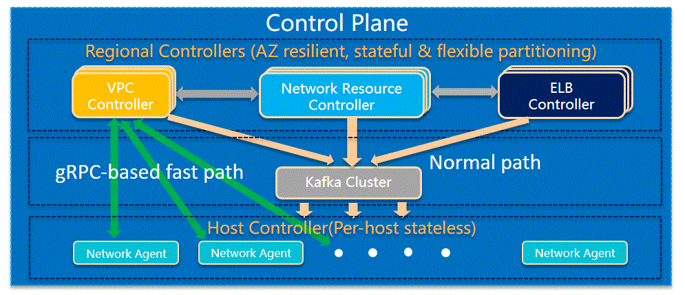

= Control Plane Fast Path

== Introduction

A fast-provisioning and scalable network control plane is the core of a competitive public cloud offering.
This would require an instantaneous delivery of networking configuration driven from a region-level Network Controller to Control Agents deployed at every server host of data center.
Due to data center scale which usually ranges from a few hundreds of thousands to a few millions of machines, a message queue subsystem (e.g., Kafka or RabbitMQ) or a multi-layer hierarchy system is usually adopted
as a high-throughput and scalable solution for network configuration update in the data center.
This approach, however, would introduce excessive latency in E2E message delivery to a scale of 2-3 ms in case of handling 100,000s message <<kafka_benchmark,1 >> <<kafka_benchmark2, 2>>.

This infrastructure limitation does not fit into some customer scenarios where ultra-low latency for E2E network configuration provisioning (in a few 10ms or 100 ms) is a critical requirement.
For example, the emerging serverless services like AWS Lambda or Azure Functions requires low latency, in the magnitude of 100 ms, as a selling point while lengthy cold start time or scale-out time harm customer experience <<serverless_limit,3>>
(the current workaround is keeping containers in a warm state by regularly sending events to serverless functions).
To provide a competitive fast-provisioning solution with our new CloudFabric Networking platform, it would be necessary to build a control plane fast path to significantly reduce the E2E provisioning time.

The main idea in this proposal is Kafka bypass and a gRPC-based direct message channel from Network Controllers to Control Agents.
gRPC has a very low medium latency of 150-300 μs in case of handling 100,000s message <<gRPC_benchmark,4>>.
This is 10x improvement compared to Kafka and those time-critical applications will benefit from the low latency of gRPC protocol.

== Architecture

The following diagram illustrates the architecture of network control plane with fast path. We have a bi-directional communication channel between them.

The top-down communication channel from Controller to Agent could be used in many scenarios which require low E2E latency for network configuration update:

. Serverless application: Reduce the instantiation time of the containers in which customers' code is running, and shorten waiting time when a serverless function is invoked for the first time or after having its configuration altered, or when a serverless function scales out.
. Provide certain SLA on service provisioning time for premium customers who are willing to pay more to get SLB-backed services.

On the other hand, the bottom-up communication channel from Agent to Controller could serve as a feedback channel to provide

. Clear status message (e.g., transit switch programming is done so that Controller could finalize endpoint host programming and give greenlight to host to send out packets.
. Actionable error situation (e.g. transit daemon down)

Later on, we could also consider to use the fast path for network health monitoring for transit Daemon/switch/router as well as local host networking components.

== Contract between Controller and Agent

The contract between Control Agent and Network Controller for top-down channel is as follows:

* Goal state message. The goal state message allows any combination of VpcState, SubnetState, PortState and SecurityGroupState, and grouping of them.
For example, one message could consists of one subnet state update with 1000 ports creation to a data-plane switch, or two VPC update to a single VM/container host.

*goalstate.proto*

[source,java]
------------------------------------------------------------
syntax = "proto3";

package aliothcontroller;

option java_package = "com.futurewei.alioth.controller.schema";

import "vpc.proto";
import "subnet.proto";
import "port.proto";
import "securitygroup.proto";

message GoalState {
   repeated VpcState vpc_states = 1;
   repeated SubnetState subnet_states = 2;
   repeated PortState port_states = 3;
   repeated SecurityGroupState security_group_states = 4;
}
------------------------------------------------------------

* VpcState message. OperationType includes CREATE, UPDATE, GET, DELETE, INFO, FINALIZE, CREATE_UPDATE_SWTICH, CREATE_UPDATE_ROUTER to cover various scenarios in network resource CURD operations.

*vpc.proto*

[source,java]
------------------------------------------------------------
syntax = "proto3";

package aliothcontroller;

option java_package = "com.futurewei.alioth.controller.schema";
option java_outer_classname = "Vpc";

import "common.proto";

message VpcState {
  OperationType operation_type = 1;
  VpcConfiguration configuration =  2;
}

------------------------------------------------------------

* VpcConfiguration message

[source,java]
------------------------------------------------------------
syntax = "proto3";

package aliothcontroller;

option java_package = "com.futurewei.alioth.controller.schema";
option java_outer_classname = "Vpc";

import "common.proto";

message VpcConfiguration {
  int32 version = 1;

  string project_id = 2;
  string id  = 3;
  string name = 4;
  string cidr = 5;
  int64 tunnel_id = 6;

  message SubnetId {
    string id = 1;
  }

  message Route {
    string destination = 1;
    string next_hop = 2;
  }

  message TransitRouter {
    string vpc_id = 1;
    string ip_address = 2;
    string mac_address = 3;
  }

  repeated SubnetId subnet_ids = 7;
  repeated Route routes = 8;
  repeated TransitRouter transit_routers = 9;
}
------------------------------------------------------------

== Proposed Changes

The control plane fast path would requires the following changes:

[width="100%",options="header"]
|====================
|Index|Feature Description|Priority|Note
|1|An additional field (is_fast_path) in REST APIs that has fast path support|P0|An example is Create/Update Port
|2|Top-down channel: .3+^.^|P0|
|2.1|gRPC server hosted in Control Agent|
|2.2|gRPC client in Network Controller|
|3|Bottom-up channel .3+^.^|P1|
|3.1|gRPC server hosted in Network Controller|
|3.2|gRPC client in Control Agent|
|4|E2E latency measurement for fast path|P0|
|5|Performance test to get scalability limit of gRPC|P1|
|====================

[bibliography]
== References

- [[kafka_benchmark]] Benchmarking Apache Kafka: 2 Million Writes Per Second (on three cheap machines): https://engineering.linkedin.com/kafka/benchmarking-apache-kafka-2-million-writes-second-three-cheap-machines
- [[kafka_benchmark2]] Benchmarking Kafka Performance: https://hackernoon.com/benchmarking-kafka-performance-part-1-write-throughput-7c7a76ab7db1
- [[serverless_limit]] Limitations of Serverless: https://www.oreilly.com/library/view/what-is-serverless/9781491984178/ch04.html
- [[gRPC_benchmark]] gRPC Official Performance Benchmark: https://performance-dot-grpc-testing.appspot.com/explore?dashboard=5652536396611584

