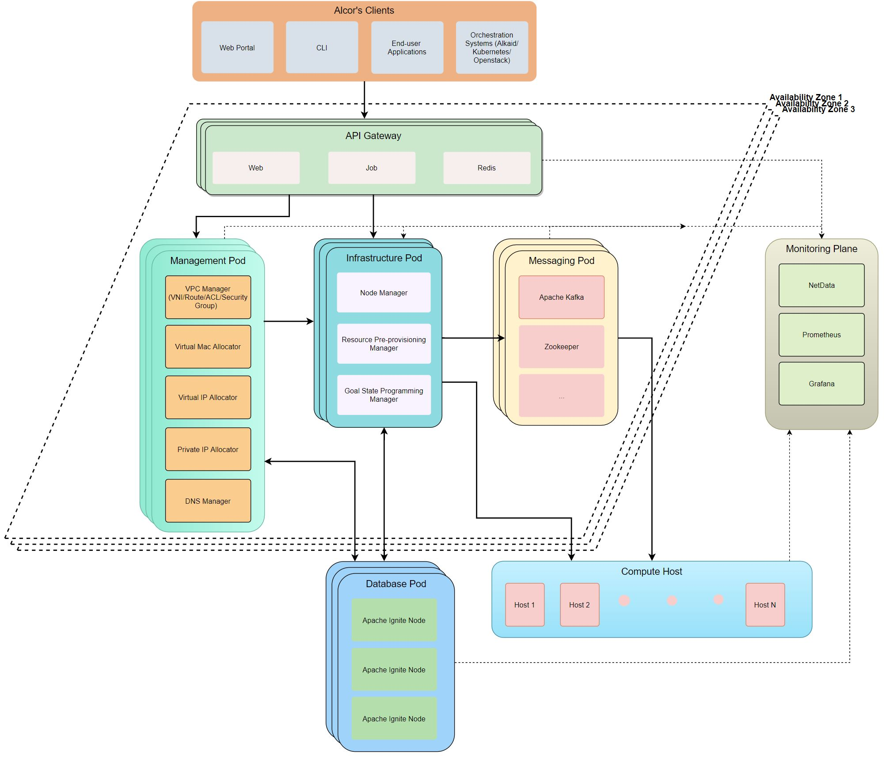

= Alcor Regional Controller Design

//== Project Scope

== High-Level Architecture

=== Design Principles

* Regional Scope, AZ resilience
* Simple network resource abstraction
* Loosely coupled components for flexible partitioning and easy scale out
* Top-down configuration driving towards eventual consistency
* Decoupling among services
** Database access only through service
** Isolation of database access and cache on the service level
** Enable flexible partitioning for various services

== Micro-Service Framework

. One controller instance is one Kubernetes application
. One microservice is one Kubernetes service
. One microservice could consist of multiple service instances (stateless or stateful) to improve availability, scalability and performance

[#ReviewDatabase]
=== Micro-service Snapshot

[width="100%",options="header"]
|====================
|Category|Micro-service Name|Acronym|Description|Type

.10+^.^|xref:mgmt_services_overview.adoc[Resource Management Services]
|xref:vpc_manager.adoc[VPC Manager]|VPM| VPC lifecycle management|Stateless
|xref:subnet_manager.adoc[Subnet Manager]|SNM| Subnet lifecycle management |Stateless
|Port Manager|PM| Port lifecycle management |Stateless
|Route Manager|RM| Route table and rule management |Stateless
|xref:private_ip_manager.adoc[Private IP Manager]|PIM| VPC private IP lifecycle management (IPv4/6) |Stateless
|xref:virtual_mac_manager.adoc[Virtual Mac Manager]|VMM| Virtual MAC pool management |Stateless
|Security Group Manager|SGM| Security group management |Stateless
|Virtual IP Manager|VIM| Public virtual IP management |Stateless
|DNS Manager|DM| DNS/DHCP record management |Stateless
|xref:node_metadata_manager.adoc[Node Metadata Manager]|NMM|Datacenter metadata management for physical nodes/machines|Stateless

.1+^.^|xref:data_store.adoc[Database and Cache Services]
|xref:data_store.adoc[Apache Ignite]| |Database services to store resource states |Stateful

.4+^.^|Infrastructure Services|
xref:data_plane_manager.adoc[Data-Plane Manager]|DPM|Responsible of sending network configuration to nodes|Stateless
|xref:network_health_monitor.adoc[Network Health Monitor] |NHM|Physical nodes/machines management for control plane, including in/out of services, health status maint|Stateless
|Gateway Manager|GM|Responsible of managing gateway|Stateless
|Resource Pre-provisioning Manager|RPM| TBD |Stateless

.2+^.^|Messaging Services|API Gateway|GW| Responsible of request routing, composition, and protocol translation |Stateless
|xref:message_queue_system.adoc[Message Queue (TBD)]|MQ| Messaging services for controller and agent communication |Stateful/Stateless

|====================

=== Concurrency and Event Ordering

Four types of concurrent network resource update:

[width="100%",options="header"]
|====================
|Concurrent Event Types|Example|Approach

| Operation on decoupled resources
| CURD of resources under two different/unpeered VPCs
| Free to update simultaneously

| Operation on loosely relevant resources
| Add one port, and delete the other in the same subnet
a|
- No conflict on resource management
- Network conf programming: Network conf versioning + version-awareness at ACA

| Operation on directly coupled resources
| Delete a VPC and create a subnet for an empty VPC
a|
- Timestamp issued by API gateway
- Check associated resource status
- DB cleanup for unstaged transactions

| Operation on the same resource
| Update operation and delete operation on the same port
a|
- Customer experience: may have different experience if executed in different order
- Resource management: no conflict (using DB concurrency + timestamp versioning)
- Network configuration programming: no conflict

|====================

== Availability Zone Resilience

TBD

== Service-to-Service Communication

TBD

//== Design Proposals
//
//=== Proposal A: Database centric design
//
//OpenStack
//Various business logics (implemented via plugin) access to the same database.
//Each service accesses to SQL database with DAO/ADO library.
//
//=== Proposal B: API server centric design
//
//Kubenetes
//Various business logics access to one (partitioned) database through API services.
//
//=== Proposal C: Service centric design
//
//Service mesh
//
//=== Proposal Comparison & Decision
//
//[width="100%",options="header"]
//|====================
//|Design|Pros|Cons
//|Option 1: Database centric design |Business logic coupling causing maintainence/upgrade challenges, business intra-interference and deep database coupling |
//|Option 2: API server centric design | | Simplied database access by standard API calls
//|Option 3: Service centric design| |
//|====================