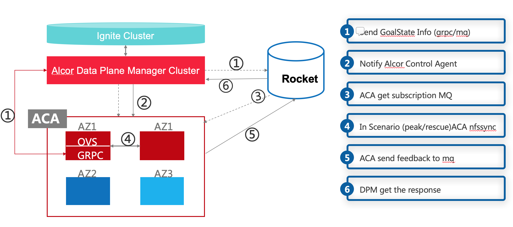

*Data Plane Manager*

*Summary* +
The Data-plane manager is a control plane component responsible of driving network configuration down to the control agents installed on the physical hosts. It provides a flexible plugin framework which allows different data-plane extension.

*User Cases* +
(1) Port Manger wants to send one new port information to every hosts in the VPC +
(2) Security Group Manager wants to send one new security group to hosts in the VPC

*Basic Requirements*

[arabic]
. Provide a flexible plugin framework which allows different data-plane extensions.
. OVS extension supports integration with OVS
. Reliably connecting to hosts through various paths including normal path (kafka) and fast path (gPRC)
. Configurable retry mechanism when connection to hosts is unstable
. Working together with other services including port manager and security group manager.
. Concurrency control mechanism should be provided to process multiple concurrent network configuration programming requests.

*Advanced Requirements* +
Fall back mechanism from one path to the other, for example, from fast path to normal path, or from normal path to rescue path

*Design*

*(1) System Structure*

* Node manager (Node Client) requests the state of every node (Node Server) periodically and each node returns through health check command (e.g. top)
* Configuration: Health check duration

[Figure 1] Data Plane Manager Structure

*(2) Data Schema*

(2.1) Goal_State Schema

[cols=",,,",options="header",]
|===
|Vpc_states |Subnet_ states |Port_ states |security_group_ states
| | | |
|===

State could contains more same type data as array

* DataPlaneManager would deploy the goal state configuration in batch to the aca grouply in parallel then wait for the response and do next accordingly

*(3) REST APIs (on-going)*

* Get
* Create
* Update
* Delete

*(1) Get Port Info By port Id*

* {blank}
+
____
Method: GET
____
* {blank}
+
____
Request: 
____

____
/project/\{projectid}/ports/\{portid},/v4/\{projectid}/ports/\{portid}
____

* {blank}
+
____
Request Parameter: 
____
** @PathVariable String projectid, @ PathVariable String portid
* {blank}
+
____
Response: node information
____
* {blank}
+
____
Example
____

Request:

http://serverIP:8080/project/3dda2801-d675-4688-a63f-dcda8d327f50/ports/f37810eb-7f83-45fa-a4d4-1b31e75399df

Response:

\{

"port": \{

"fastPath": true,

"project_id": "3dda2801-d675-4688-a63f-dcda8d327f50",

"id": "22222222-7f83-45fa-a4d4-1b31e7539922",

"name": "test_cni_port22",

"description": "",

"network_id": "a87e0f87-a2d9-44ef-9194-9a62f178594e",

"tenant_id": null,

"admin_state_up": true,

"mac_address": "0e:73:ae:c8:0:9",

"veth_name": "veth0",

"fast_path": true,

"device_id": null,

"device_owner": null,

"status": "UP",

"fixed_ips": [

\{

"subnet_id": "a87e0f87-a2d9-44ef-9194-9a62f178594e",

"ip_address": "10.0.0.9"

}

],

"allowed_address_pairs": null,

"extra_dhcp_opts": null,

"security_groups": null,

"binding:host_id": "ephost_1",

"binding:profile": null,

"binding:vnic_type": null,

"network_ns": "/var/run/netns/test_netw_ns2",

"dns_name": null,

"dns_assignment": null

}

} *(2) Create Ports in Batch*

* {blank}
+
____
Method: POST
____
* {blank}
+
____
Request: /project/\{projectid}/ports", "v4/\{projectid}/ports
____
* {blank}
+
____
Request Parameter: 
____
** @PathVariable String projectid, @PathVariable String portid, @RequestBody PortStateJson resource
* {blank}
+
____
Response: portstate information
____
* {blank}
+
____
Example
____

Request:

http://localhost:8080/project/3dda2801-d675-4688-a63f-dcda8d327f50/ports

Body:

\{"port":

\{"project_id": "3dda2801-d675-4688-a63f-dcda8d327f50",

"id": "22222222-7f83-45fa-a4d4-1b31e7539922",

"name": "test_cni_port22",

"description": "",

"network_id": "a87e0f87-a2d9-44ef-9194-9a62f178594e",

"tenant_id": null,

"admin_state_up": true,

"mac_address": null,

"veth_name": "veth0",

"device_id": null,

"device_owner": null,

"status": null,

"fixed_ips": [],

"allowed_address_pairs": null,

"extra_dhcp_opts": null,

"security_groups": null,

"binding:host_id": "ephost_1",

"binding:profile": null,

"binding:vnic_type": null,

"network_ns": "/var/run/netns/test_netw_ns2",

"dnsName": null,

"dnsAssignment": null,

"fast_path": true }

}

Response:

\{

"port": \{

"fastPath": true,

"project_id": "3dda2801-d675-4688-a63f-dcda8d327f50",

"id": "22222222-7f83-45fa-a4d4-1b31e7539922",

"name": "test_cni_port22",

"description": "",

"network_id": "a87e0f87-a2d9-44ef-9194-9a62f178594e",

"tenant_id": null,

"admin_state_up": true,

"mac_address": "0e:73:ae:c8:0:9",

"veth_name": "veth0",

"fast_path": true,

"device_id": null,

"device_owner": null,

"status": "UP",

"fixed_ips": [

\{

"subnet_id": "a87e0f87-a2d9-44ef-9194-9a62f178594e",

"ip_address": "10.0.0.9"

}

],

"allowed_address_pairs": null,

"extra_dhcp_opts": null,

"security_groups": null,

"binding:host_id": "ephost_1",

"binding:profile": null,

"binding:vnic_type": null,

"network_ns": "/var/run/netns/test_netw_ns2",

"dns_name": null,

"dns_assignment": null

}

}

*Reference*

[arabic]
. https://github.com/futurewei-cloud/alcor/issues/166
