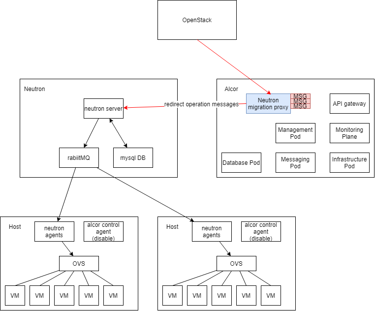

= Migration, Deployment and Upgrade
Author Name <author@email.com>
v0.1, 2020-05-17
:toc: right

NOTE: This document is under development

== Migration Plan from Openstack Neutron

First, the structures of Neutron models are not consistent with the Alcor's. 
We need a tool that can transform the existing Neutron network configurations into the Alcor's, so that Alcor can process it.
These converted network configurations should be handled by Alcor as batch creation operation messages with all parameters specified.

However, we still want users to be able to continue configuring on this openstack environment, 
as we use the tool to convert the netruon network configurations to Alcors.
At this time, the virtual switch in compute node side should still be taken over by neutron agents, 
and an alcor control agent should be in a state that can normally receive configuration, 
but does not send configuration to the virtual switch.
The newly generated configuration during this conversion may not be simultaneously converted to Alcor and processed, 
therefore, we also need to intercept all the operation messages received by the Neutron during the conversion period.
And in addition to passing them through to the Neutron so that the Neutron can normally process the messages,
we also need to copy those operation messages and temporarily cache them.

After the conversion of the original network configurations is completed, 
these cached operation messages should also be converted to alcor's messages and processed.

After that, the openstack CLI can switch to send operation messages directly to Alcor.
Finally, the virtural switch of the compute node can be taken over to the alcor control agent after waiting for appropriate time, 
so that the messages already in the neuron pipeline can be complete processed. 
Thus, the migration is completed.

image::images/neutron_migration_phase3.png["Migration Phase3", width=1024, link="images/neutron_migration_phase3.png"]

Topic: Gracefully migrate user data and switch user traffic from existing OpenStack Neutron clusters to Alcor

== Deployment Plan

== Upgrade Plan with Grey Release

