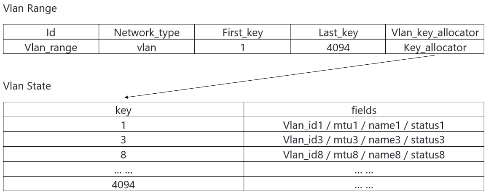
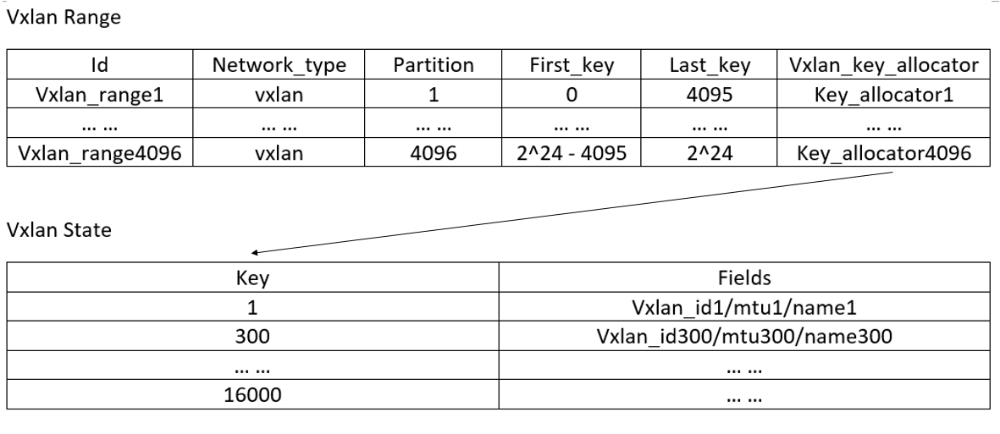
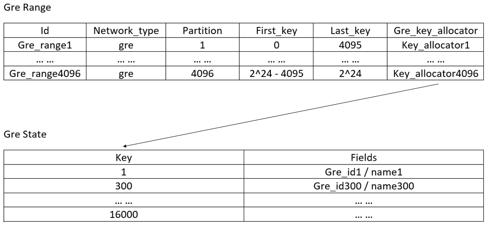

= VPC Manager Design Specification
Zhonghao Lyu <zlyu@futurewei.com>, Liguang Xie <lxie@futurewei.com>
v0.1, 2020-05-04
:toc: right

== Overview

== Service Requirements

== Design

=== Service Architecture

=== Key Workflow

=== Concurrency Control

== Database Schema
=== Network Vlan Range and Vlan State

=== Network Vxlan Range and Vxlan State

=== Network Gre Range and Gre State

== REST APIs

=== API Snapshot

[width="100%",cols="22%,12%,50%,17%"]
|===
|*API Name* |*Method* |*Request*|*Response*

//|Verify MAC State
//|GET
//|/macs/{mac}, /v4/macs/{mac}
//|mac state
//<<Mac_Get,[sample]>>
|===

=== API Specification

