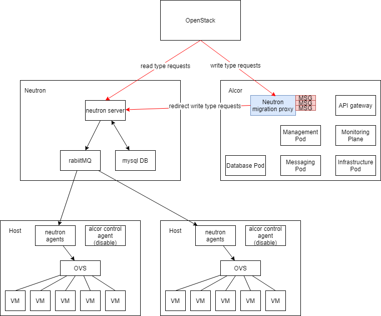
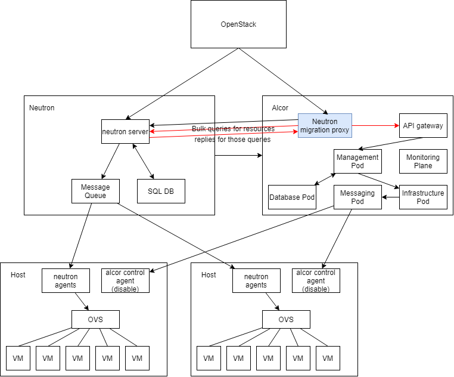
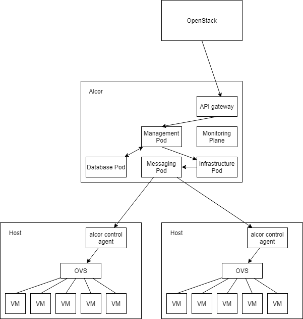

= Migration, Deployment and Upgrade
Author Name <author@email.com>
v0.1, 2020-05-17
:toc: right

NOTE: This document is under development

== Migration Plan from Openstack Neutron

=== Step 1: Active Neutron and Passive Alcor with Request Caching

First, the structures of Neutron models are not consistent with the Alcor's. 
We need a tool that can convert the existing Neutron network configurations into the Alcor's, so that Alcor can process it.
These converted network configurations should be handled by Alcor as batch creation requests with all parameters specified.

However, we still want users to be able to continue configuring on this openstack environment, 
as we use the tool to convert the netruon network configurations to Alcor's.
At this time, the virtual switch in compute node side should still be taken over by neutron agents, 
and an alcor control agent should be in a state that can normally receive configurations, 
but does not send configurations to the virtual switch.

The newly generated configuration during this conversion may not be simultaneously converted to Alcor and processed, 
therefore, we also need to intercept all the write type requests received by the Neutron during the conversion period.
And in addition to passing them through to the Neutron so that the Neutron can normally process the requests,
we also need to copy those requests and temporarily cache them.

It should be mentioned that, in a production environment, 
the amount of requests of the write type is very small compared to the amount of requests read, 
so the performance and memory consumption of the message proxy and cache can be controlled over the converson period.

=== Step 2: Proactive Request Processing by Alcor

After the conversion of the original network configurations is completed, 
these cached write type requests should also be converted to alcor's requests and processed.

=== Step 3: Seamless Transition to Active Alcor

After that, the openstack CLI can switch to send requests directly to Alcor. 
The virtural switch of the compute node can also be taken over to the alcor control agent after waiting for appropriate time, 
so that the requests already in the neuron pipeline can be complete processed. 
Thus, the migration is completed.

Topic: Gracefully migrate user data and switch user traffic from existing OpenStack Neutron clusters to Alcor

== Deployment Plan

== Upgrade Plan with Grey Release

