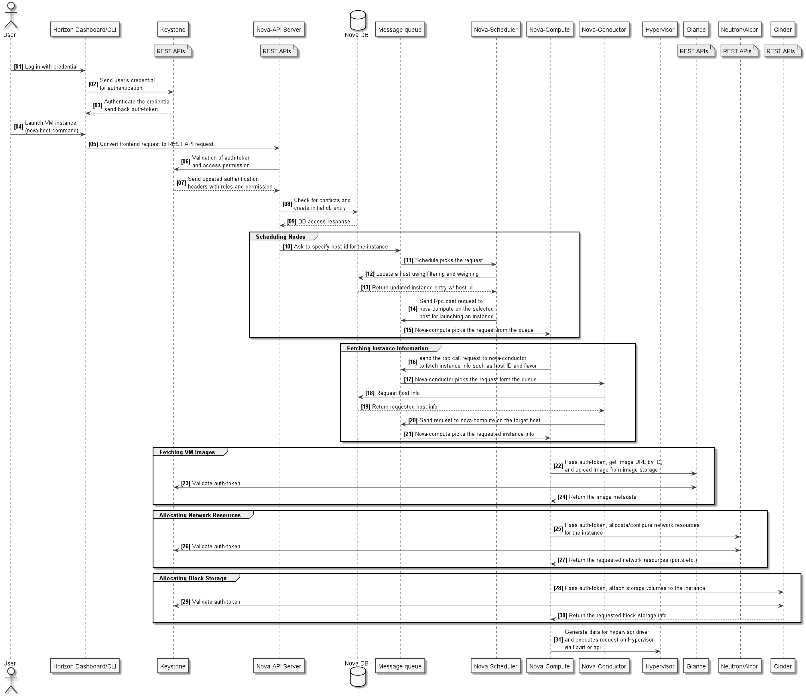

= Integration with OpenStack Nova
v0.1, 2020-05-17
:toc: right
:imagesdir: ../../images

NOTE: This document is under development

== Overview

OpenStack allows users to launch VM instance via Horizon Dashboard or run nova boot command via OpenStack CLI.
When it occurs, Nova compute would trigger a few REST calls to Neutron to allocate necessary network resources.
We would want to integrate with Nova to support the same set of user operations, especially the vm creation scenario.

[#system-requirements]
== Integration Requirements

. Identify all necessary changes (configuration and/or codes) in Nova to call Alcor REST APIs, instead of Neutron APIs
. Make a proposal that requires minimal Nova changes
. Implement the code/configuration change
. Deploy and test the change in a multi-node OpenStack cluster

== Review of OpenStack Workflow

=== VM Creation Workflow
<<<<<<< HEAD:docs/modules/ROOT/pages/deploy_related/integration_nova.adoc
image::vm_create.png["VM creation workflow", width=1024, link="vm_create.png"]
=======

>>>>>>> c15dc8513262a277de2d066776407449acc1668b:docs/design/integration_nova.adoc

== Required Changes

TBD

== Integration Proposal

TBD

== Test Plan

TBD