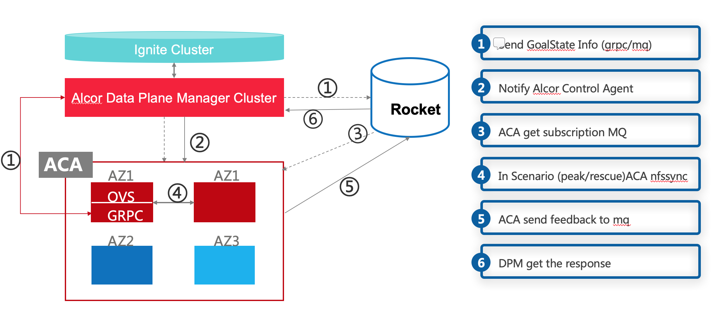
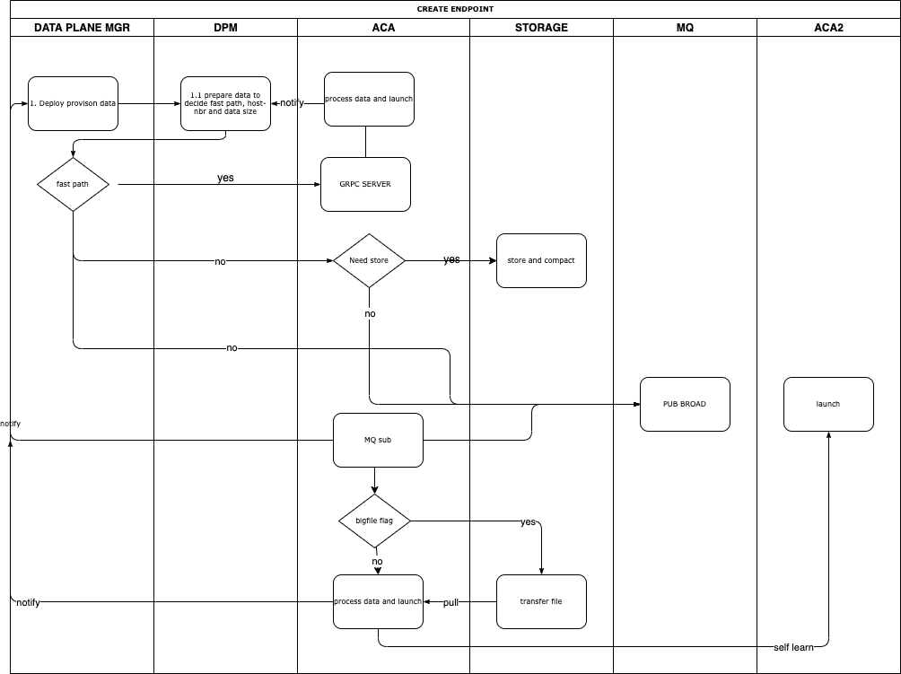
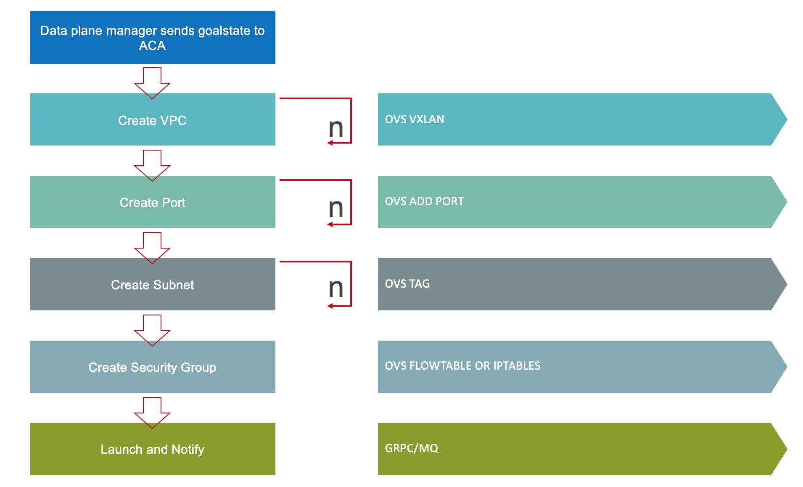
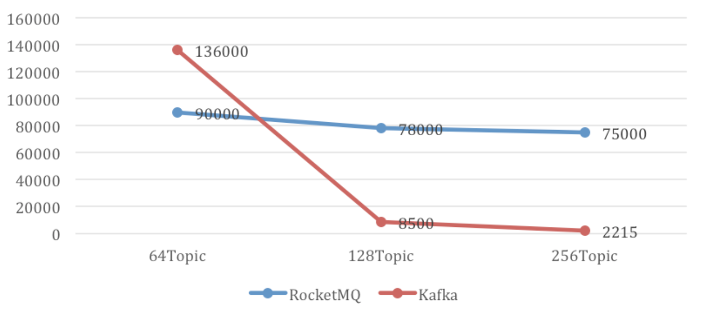
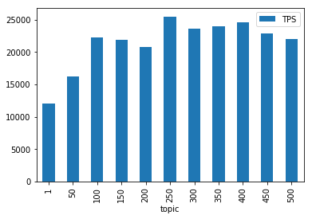
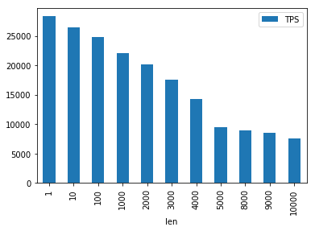
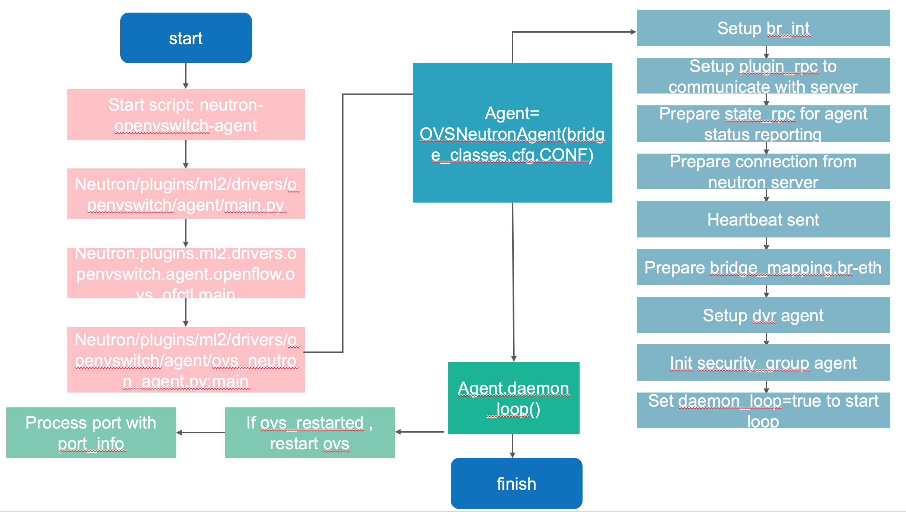

= Data-Plane Manager Design Specification
Xiaodong Zhang <xzhang2@futurewei.com>, Liguang Xie <lxie@futurewei.com>
v0.1, 2020-04-30
:toc: right

== Overview

The Data-plane manager is a control plane component responsible of driving network configuration down to the control agents installed on the physical hosts.
It provides a flexible plugin framework which allows different data-plane extension.

=== User Cases

{empty}(1) Port Manger wants to send one new port information to every hosts in the VPC +
(2) Security Group Manager wants to send one new security group to hosts in the VPC

== Service Requirements

=== Basic Requirements

[arabic]
. Provide a flexible plugin framework which allows different data-plane extensions.
. OVS extension supports integration with OVS
. Reliably connecting to hosts through various paths including normal path (kafka) and fast path (gPRC)
. Configurable retry mechanism when connection to hosts is unstable
. Working together with other services including port manager and security group manager.
. Concurrency control mechanism should be provided to process multiple concurrent network configuration programming requests.

=== Advanced Requirements

Fall back mechanism from one path to the other, for example, from fast path to normal path, or from normal path to rescue path

== Data-Plane Microservice Design

=== Architecture

[Figure 1] Data Plane Manager Structure

=== Extensible Design to Support Various Data-Plane

Upstream microservices doesn't need to know about the actual data-plane implementation.

. OVS Extension
. Mizar Gateway Extension (later)

=== Key Worfklow

. Create first port in a subnet

[Figure 2] create first port 

[Figure 3] create first port 

. Create a port in an existing subnet
. Update a port
. Get a port
. Delete a port

=== Concurrency Control

Data plane manger service would do the provision work concurrently using multithread technology.

== Communication with Agent

=== Message Design
* For initial data we would do full update with nfs* support and notification on messaging Q
* We would use delta update for small amount of update to deploy
* NFS could support up to 30G/s speed and we could use advanced nfs to get half of response time with bypassing kernel 

=== Multi-path Control Logic

. Normal Path
. Fast Path
. Rescue Path

Logic:

. Initially we would use fast path (grpc) to tell agent the info about next step
. We would normally use normal path to do agent provision and nfs for big file (3GB file with gzip would cost about 3s)
. When heart beat loss decteted (via Netdata) , data plane manager would send out rescue message to MessagingQ to let adjacent ovs do remote rescue

==== Problems solution:

. To solve the misorder data, put them in same queue
. Use the tag to filter msg.
. RocketMQ could support way more topic number with stable performance, we need to fine tune the parameter for dirty page and memory usage
. We need to identify the detail scenario for peak scenario of 3GB deployment

. Since Kafka would drop lots of performance when topic number is higher, RocketMQ is stable

[Figure 4] Performance drop when topics nubmer is greater

[Figure 5] Performance drop when topics nubmer is greater

. When message body is greater than 4k , the performance would drop greatly

[Figure 6] Message size and the performance drop

. Here is the Neutron way to start ovs and do processing

[Figure 7] Neutron way to start ovs and do processing

. GRPC is not fit for transfering big file since it basically focus more on the assumption of small numbers in the data

== Database Schema

[cols=",,,",options="header",]
|===
|Vpc_states |Subnet_ states |Port_ states |security_group_ states
| | | |
|===

State could contains more same type data as array

* DataPlaneManager would deploy the NetworkConfiguration configuration in batch to the ACA grouply in parallel then wait for the response and do next accordingly.

== REST APIs

=== API Snapshot

[width="100%",cols="22%,12%,50%,17%"]
|===
|*API Name* |*Method* |*Request*|*Response*

|(Bulk) Create Port by NetworkConfiguration
|POST
|/port
|NetworkConfiguration list
<<Create_Port_NetworkConfiguration,[sample]>>

|(Bulk) Delete Port by NetworkConfiguration
|DELETE
|/port
|NetworkConfiguration
<<Delete_Port_NetworkConfiguration,[sample]>>

|(Bulk) Update NetworkConfiguration
|PUT
|/NetworkConfiguration/{NetworkConfigurations}
|NetworkConfiguration
<<Update_NetworkConfiguration,[sample]>>

|===

=== API Specification

* (Bulk) Update NetworkConfiguration
* (Bulk) Create Port with NetworkConfiguration
* (Bulk) Delete Port with NetworkConfiguration

anchor:Create_Port_NetworkConfiguration[]

====  (1) Send NetworkConfiguration to create port

* Method: `POST`

* Request: `/port/,/v4/port/`

* Request Parameter:  `@RequestBody networkConfiguration`

* Response: Port creation result information

* Normal response codes: 200

* Error response codes: 400, 412, 500

* Example
* Use Case Desc: 
` client should send out NetworkConfiguration to create (bulk) port(s)  unless port to be created inside the NetworkConfiguration itself in which case client should remember the neighbor infos among newly created ports `

http://localhost:8080/v4/port/

Body:

------------------------------------------------------------
{
	"vpcs_internal": [{
		"project_id": "3dda2801-d675-4688-a63f-dcda8d327f50",
		"id": "9192a4d4-ffff-4ece-b3f0-8d36e3d88038",
		"name": "test_vpc",
		"description": "",
		"cidr": "192.168.0.0/16"
	}
],
	"subnets_internal": [{
		"project_id": "3dda2801-d675-4688-a63f-dcda8d327f50",
		"network_id": "9192a4d4-ffff-4ece-b3f0-8d36e3d88038",
		"id": "a87e0f87-a2d9-44ef-9194-9a62f178594f",
		"name": "test_subnet2",
		"description": "",
		"cidr": "192.168.2.0/24",
		"gateway_ip": "192.168.2.1",
		"availability_zone": "uswest-1",
		"dhcp_enable": false,
		"primary_dns": null,
		"secondary_dns": null,
		"dns_list": null,
			"tunnel_id": "88889"
	}],
	"ports_internal": [{
		"project_id": "3dda2801-d675-4688-a63f-dcda8d327f50",
		"id": "f37810eb-7f83-45fa-a4d4-1b31e75399d3",
		"name": "test_cni_port2",
		"description": "",
    	"binding_host_ip": "10.213.43.187",
		"vpc_id": "9192a4d4-ffff-4ece-b3f0-8d36e3d88038",
		"tenant_id": null,
		"admin_state_up": true,
		"mac_address": "86:ea:77:ad:52:55",
		"veth_name": "veth0",
		"device_id": null,
		"device_owner": null,
		"status": null,
		"neighbor_host_ip": null,
		"fixed_ips": [{
			"ip_address": "192.168.2.2",
			"subnet_id": "a87e0f87-a2d9-44ef-9194-9a62f178594f"
		}
		],
		"allowed_address_pairs": null,
		"extra_dhcp_opts": null,
		"security_groups": null,
		"binding:host_id": "ephost_0",
		"binding:profile": null,
		"binding:vnic_type": null,
		"network_ns": "/var/run/netns/test_netw_ns",
		"dnsName": null,
		"dnsAssignment": null,
		"fast_path": true
	}, {
		"project_id": "3dda2801-d675-4688-a63f-dcda8d327f50",
		"id": "f37810eb-7f83-45fa-a4d4-1b31e75399d0",
		"name": "test_cni_port3",
		"description": "",
		"binding_host_ip": "10.213.43.187",
		"vpc_id": "9192a4d4-ffff-4ece-b3f0-8d36e3d88038",
		"tenant_id": null,
		"admin_state_up": true,
		"mac_address": "86:ea:77:ad:52:56",
		"veth_name": "veth0",
		"device_id": null,
		"device_owner": null,
		"status": null,
		"neighbor_host_ip": null,
		"fixed_ips": [{
			"ip_address": "192.168.2.3",
			"subnet_id": "a87e0f87-a2d9-44ef-9194-9a62f178594f"
		}],
		"allowed_address_pairs": null,
		"extra_dhcp_opts": null,
		"security_groups": null,
		"binding:host_id": "ephost_0",
		"binding:profile": null,
		"binding:vnic_type": null,
		"network_ns": "/var/run/netns/test_netw_ns",
		"dnsName": null,
		"dnsAssignment": null,
		"fast_path": true
	}, {
		"project_id": "3dda2801-d675-4688-a63f-dcda8d327f50",
		"id": "f37810eb-7f83-45fa-a4d4-1b31e75399d6",
		"name": "test_cni_port4",
		"description": "",
		"binding_host_ip": "10.213.43.188",
		"vpc_id": "9192a4d4-ffff-4ece-b3f0-8d36e3d88038",
		"tenant_id": null,
		"admin_state_up": true,
		"mac_address": "86:ea:77:ad:52:57",
		"veth_name": "veth0",
		"device_id": null,
		"device_owner": null,
		"status": null,
		"neighbor_host_ip": null,
		"fixed_ips": [{
			"ip_address": "192.168.2.4",
			"subnet_id": "a87e0f87-a2d9-44ef-9194-9a62f178594f"
		}],
		"allowed_address_pairs": null,
		"extra_dhcp_opts": null,
		"security_groups": null,
		"binding:host_id": "ephost_0",
		"binding:profile": null,
		"binding:vnic_type": null,
		"network_ns": "/var/run/netns/test_netw_ns",
		"dnsName": null,
		"dnsAssignment": null,
		"fast_path": true
	}, {
		"project_id": "3dda2801-d675-4688-a63f-dcda8d327f50",
		"id": "f37810eb-7f83-45fa-a4d4-1b31e75399d7",
		"name": "test_cni_port5",
		"description": "",
		"binding_host_ip": "10.213.43.188",
		"vpc_id": "9192a4d4-ffff-4ece-b3f0-8d36e3d88038",
		"tenant_id": null,
		"admin_state_up": true,
		"mac_address": "86:ea:77:ad:52:58",
		"veth_name": "veth0",
		"device_id": null,
		"device_owner": null,
		"status": null,
		"neighbor_host_ip": null,
		"fixed_ips": [{
			"ip_address": "192.168.2.5",
			"subnet_id": "a87e0f87-a2d9-44ef-9194-9a62f178594f"
		}	
		],
		"allowed_address_pairs": null,
		"extra_dhcp_opts": null,
		"security_groups": null,
		"binding:host_id": "ephost_0",
		"binding:profile": null,
		"binding:vnic_type": null,
		"network_ns": "/var/run/netns/test_netw_ns",
		"dnsName": null,
		"dnsAssignment": null,
		"fast_path": true
	}],
	"security_groups_internal": [{}, {}]
}
------------------------------------------------------

[source,c++]
------------------------------------------------------------
Response:
[
  {
    "resource_id": "a87e0f87-a2d9-44ef-9194-9a62f178594f",
    "resource_type": "SUBNET",
    "operation_status": "SUCCESS",
    "elapse_time": 1144
  },
  {
    "resource_id": "f37810eb-7f83-45fa-a4d4-1b31e75399d7",
    "resource_type": "PORT",
    "operation_status": "FAILURE",
    "elapse_time": 16049231
  },
  {
    "resource_id": "f37810eb-7f83-45fa-a4d4-1b31e75399d6",
    "resource_type": "PORT",
    "operation_status": "FAILURE",
    "elapse_time": 16965153
  },
  {
    "resource_id": "a87e0f87-a2d9-44ef-9194-9a62f178594f",
    "resource_type": "SUBNET",
    "operation_status": "SUCCESS",
    "elapse_time": 1312
  },
  {
    "resource_id": "f37810eb-7f83-45fa-a4d4-1b31e75399d3",
    "resource_type": "PORT",
    "operation_status": "SUCCESS",
    "elapse_time": 17845598
  },
  {
    "resource_id": "f37810eb-7f83-45fa-a4d4-1b31e75399d0",
    "resource_type": "PORT",
    "operation_status": "SUCCESS",
    "elapse_time": 18663054
  }
]

------------------------------------------------------------

* Use Case Desc: 
` client should send out NetworkConfiguration to tell info about neighbor to  (bulk) port(s) along unless port to be created inside the NetworkConfiguration itself in which case client should remember the neighbor infos among newly created ports `

http://localhost:8080/v4/port/

Body:

------------------------------------------------------------
{
	"vpcs_internal": [{
		"project_id": "3dda2801-d675-4688-a63f-dcda8d327f50",
		"id": "9192a4d4-ffff-4ece-b3f0-8d36e3d88038",
		"name": "test_vpc",
		"description": "",
		"cidr": "192.168.0.0/16"
	}
],
	"subnets_internal": [{
		"project_id": "3dda2801-d675-4688-a63f-dcda8d327f50",
		"network_id": "9192a4d4-ffff-4ece-b3f0-8d36e3d88038",
		"id": "a87e0f87-a2d9-44ef-9194-9a62f178594f",
		"name": "test_subnet2",
		"description": "",
		"cidr": "192.168.2.0/24",
		"gateway_ip": "192.168.2.1",
		"availability_zone": "uswest-1",
		"dhcp_enable": false,
		"primary_dns": null,
		"secondary_dns": null,
		"dns_list": null,
			"tunnel_id": "88889"
	}],
	"ports_internal": [{
		"project_id": "3dda2801-d675-4688-a63f-dcda8d327f50",
		"id": "f37810eb-7f83-45fa-a4d4-1b31e75399d3",
		"name": "test_cni_port2",
		"description": "",
    	"binding_host_ip": "10.213.43.187",
		"vpc_id": "9192a4d4-ffff-4ece-b3f0-8d36e3d88038",
		"tenant_id": null,
		"admin_state_up": true,
		"mac_address": "86:ea:77:ad:52:55",
		"veth_name": "veth0",
		"device_id": null,
		"device_owner": null,
		"status": null,
		"neighbor_host_ip": null,
		"fixed_ips": [{
			"ip_address": "192.168.2.2",
			"subnet_id": "a87e0f87-a2d9-44ef-9194-9a62f178594f"
		}
		],
		"allowed_address_pairs": null,
		"extra_dhcp_opts": null,
		"security_groups": null,
		"binding:host_id": "ephost_0",
		"binding:profile": null,
		"binding:vnic_type": null,
		"network_ns": "/var/run/netns/test_netw_ns",
		"dnsName": null,
		"dnsAssignment": null,
		"fast_path": true
	}, {
		"project_id": "3dda2801-d675-4688-a63f-dcda8d327f50",
		"id": "f37810eb-7f83-45fa-a4d4-1b31e75399d0",
		"name": "test_cni_port3",
		"description": "",
		"binding_host_ip": "10.213.43.187",
		"vpc_id": "9192a4d4-ffff-4ece-b3f0-8d36e3d88038",
		"tenant_id": null,
		"admin_state_up": true,
		"mac_address": "86:ea:77:ad:52:56",
		"veth_name": "veth0",
		"device_id": null,
		"device_owner": null,
		"status": null,
		"neighbor_host_ip": null,
		"fixed_ips": [{
			"ip_address": "192.168.2.3",
			"subnet_id": "a87e0f87-a2d9-44ef-9194-9a62f178594f"
		}],
		"allowed_address_pairs": null,
		"extra_dhcp_opts": null,
		"security_groups": null,
		"binding:host_id": "ephost_0",
		"binding:profile": null,
		"binding:vnic_type": null,
		"network_ns": "/var/run/netns/test_netw_ns",
		"dnsName": null,
		"dnsAssignment": null,
		"fast_path": true
	}, {
		"project_id": "3dda2801-d675-4688-a63f-dcda8d327f50",
		"id": "f37810eb-7f83-45fa-a4d4-1b31e75399d6",
		"name": "test_cni_port4",
		"description": "",
		"binding_host_ip": "10.213.43.188",
		"vpc_id": "9192a4d4-ffff-4ece-b3f0-8d36e3d88038",
		"tenant_id": null,
		"admin_state_up": true,
		"mac_address": "86:ea:77:ad:52:57",
		"veth_name": "veth0",
		"device_id": null,
		"device_owner": null,
		"status": null,
		"neighbor_host_ip": null,
		"fixed_ips": [{
			"ip_address": "192.168.2.4",
			"subnet_id": "a87e0f87-a2d9-44ef-9194-9a62f178594f"
		}],
		"allowed_address_pairs": null,
		"extra_dhcp_opts": null,
		"security_groups": null,
		"binding:host_id": "ephost_0",
		"binding:profile": null,
		"binding:vnic_type": null,
		"network_ns": "/var/run/netns/test_netw_ns",
		"dnsName": null,
		"dnsAssignment": null,
		"fast_path": true
	}, {
		"project_id": "3dda2801-d675-4688-a63f-dcda8d327f50",
		"id": "f37810eb-7f83-45fa-a4d4-1b31e75399d7",
		"name": "test_cni_port5",
		"description": "",
		"binding_host_ip": "10.213.43.188",
		"vpc_id": "9192a4d4-ffff-4ece-b3f0-8d36e3d88038",
		"tenant_id": null,
		"admin_state_up": true,
		"mac_address": "86:ea:77:ad:52:58",
		"veth_name": "veth0",
		"device_id": null,
		"device_owner": null,
		"status": null,
		"neighbor_host_ip": null,
		"fixed_ips": [{
			"ip_address": "192.168.2.5",
			"subnet_id": "a87e0f87-a2d9-44ef-9194-9a62f178594f"
		}	
		],
		"allowed_address_pairs": null,
		"extra_dhcp_opts": null,
		"security_groups": null,
		"binding:host_id": "ephost_0",
		"binding:profile": null,
		"binding:vnic_type": null,
		"network_ns": "/var/run/netns/test_netw_ns",
		"dnsName": null,
		"dnsAssignment": null,
		"fast_path": true
	}],
	"security_groups_internal": [{}, {}]
}

------------------------------------------------------

[source,c++]
------------------------------------------------------------
Response:

[
  {
    "resource_id": "a87e0f87-a2d9-44ef-9194-9a62f178594f",
    "resource_type": "SUBNET",
    "operation_status": "SUCCESS",
    "elapse_time": 1453
  },
  {
    "resource_id": "f37810eb-7f83-45fa-a4d4-1b31e75399d6",
    "resource_type": "PORT",
    "operation_status": "FAILURE",
    "elapse_time": 14324833
  },
  {
    "resource_id": "f37810eb-7f83-45fa-a4d4-1b31e75399d7",
    "resource_type": "PORT",
    "operation_status": "FAILURE",
    "elapse_time": 15699412
  },
  {
    "resource_id": "a87e0f87-a2d9-44ef-9194-9a62f178594f",
    "resource_type": "SUBNET",
    "operation_status": "SUCCESS",
    "elapse_time": 1295
  },
  {
    "resource_id": "f37810eb-7f83-45fa-a4d4-1b31e75399d0",
    "resource_type": "PORT",
    "operation_status": "FAILURE",
    "elapse_time": 13440560
  },
  {
    "resource_id": "f37810eb-7f83-45fa-a4d4-1b31e75399d3",
    "resource_type": "PORT",
    "operation_status": "FAILURE",
    "elapse_time": 14759023
  }
]
------------------------------------------------------------

anchor:Delete_Port_NetworkConfiguration[]

====  (2) (Bulk) Send NetworkConfiguration to delete port

* Method: `DELETE`

* Request: `/port,/v4/port`

* Request Parameter:  `@RequestBody NetworkConfiguration`

* Response: Port deletion result information

* Normal response codes: 200

* Error response codes: 400, 412, 500

* Example

http://localhost:8080/NetworkConfiguration/

Body:

------------------------------------------------------------
{
	"vpcs_internal": [{
		"project_id": "3dda2801-d675-4688-a63f-dcda8d327f50",
		"id": "9192a4d4-ffff-4ece-b3f0-8d36e3d88038",
		"name": "test_vpc",
		"description": "",
		"cidr": "192.168.0.0/16"
	}
],
	"subnets_internal": [{
		"project_id": "3dda2801-d675-4688-a63f-dcda8d327f50",
		"network_id": "9192a4d4-ffff-4ece-b3f0-8d36e3d88038",
		"id": "a87e0f87-a2d9-44ef-9194-9a62f178594f",
		"name": "test_subnet2",
		"description": "",
		"cidr": "192.168.2.0/24",
		"gateway_ip": "192.168.2.1",
		"availability_zone": "uswest-1",
		"dhcp_enable": false,
		"primary_dns": null,
		"secondary_dns": null,
		"dns_list": null,
			"tunnel_id": "88889"
	}],
	"ports_internal": [{
		"project_id": "3dda2801-d675-4688-a63f-dcda8d327f50",
		"id": "f37810eb-7f83-45fa-a4d4-1b31e75399d3",
		"name": "test_cni_port2",
		"description": "",
    	"binding_host_ip": "10.213.43.187",
		"vpc_id": "9192a4d4-ffff-4ece-b3f0-8d36e3d88038",
		"tenant_id": null,
		"admin_state_up": true,
		"mac_address": "86:ea:77:ad:52:55",
		"veth_name": "veth0",
		"device_id": null,
		"device_owner": null,
		"status": null,
		"neighbor_host_ip": null,
		"fixed_ips": [{
			"ip_address": "192.168.2.2",
			"subnet_id": "a87e0f87-a2d9-44ef-9194-9a62f178594f"
		}
		],
		"allowed_address_pairs": null,
		"extra_dhcp_opts": null,
		"security_groups": null,
		"binding:host_id": "ephost_0",
		"binding:profile": null,
		"binding:vnic_type": null,
		"network_ns": "/var/run/netns/test_netw_ns",
		"dnsName": null,
		"dnsAssignment": null,
		"fast_path": true
	}, {
		"project_id": "3dda2801-d675-4688-a63f-dcda8d327f50",
		"id": "f37810eb-7f83-45fa-a4d4-1b31e75399d0",
		"name": "test_cni_port3",
		"description": "",
		"binding_host_ip": "10.213.43.187",
		"vpc_id": "9192a4d4-ffff-4ece-b3f0-8d36e3d88038",
		"tenant_id": null,
		"admin_state_up": true,
		"mac_address": "86:ea:77:ad:52:56",
		"veth_name": "veth0",
		"device_id": null,
		"device_owner": null,
		"status": null,
		"neighbor_host_ip": null,
		"fixed_ips": [{
			"ip_address": "192.168.2.3",
			"subnet_id": "a87e0f87-a2d9-44ef-9194-9a62f178594f"
		}],
		"allowed_address_pairs": null,
		"extra_dhcp_opts": null,
		"security_groups": null,
		"binding:host_id": "ephost_0",
		"binding:profile": null,
		"binding:vnic_type": null,
		"network_ns": "/var/run/netns/test_netw_ns",
		"dnsName": null,
		"dnsAssignment": null,
		"fast_path": true
	}, {
		"project_id": "3dda2801-d675-4688-a63f-dcda8d327f50",
		"id": "f37810eb-7f83-45fa-a4d4-1b31e75399d6",
		"name": "test_cni_port4",
		"description": "",
		"binding_host_ip": "10.213.43.188",
		"vpc_id": "9192a4d4-ffff-4ece-b3f0-8d36e3d88038",
		"tenant_id": null,
		"admin_state_up": true,
		"mac_address": "86:ea:77:ad:52:57",
		"veth_name": "veth0",
		"device_id": null,
		"device_owner": null,
		"status": null,
		"neighbor_host_ip": null,
		"fixed_ips": [{
			"ip_address": "192.168.2.4",
			"subnet_id": "a87e0f87-a2d9-44ef-9194-9a62f178594f"
		}],
		"allowed_address_pairs": null,
		"extra_dhcp_opts": null,
		"security_groups": null,
		"binding:host_id": "ephost_0",
		"binding:profile": null,
		"binding:vnic_type": null,
		"network_ns": "/var/run/netns/test_netw_ns",
		"dnsName": null,
		"dnsAssignment": null,
		"fast_path": true
	}, {
		"project_id": "3dda2801-d675-4688-a63f-dcda8d327f50",
		"id": "f37810eb-7f83-45fa-a4d4-1b31e75399d7",
		"name": "test_cni_port5",
		"description": "",
		"binding_host_ip": "10.213.43.188",
		"vpc_id": "9192a4d4-ffff-4ece-b3f0-8d36e3d88038",
		"tenant_id": null,
		"admin_state_up": true,
		"mac_address": "86:ea:77:ad:52:58",
		"veth_name": "veth0",
		"device_id": null,
		"device_owner": null,
		"status": null,
		"neighbor_host_ip": null,
		"fixed_ips": [{
			"ip_address": "192.168.2.5",
			"subnet_id": "a87e0f87-a2d9-44ef-9194-9a62f178594f"
		}	
		],
		"allowed_address_pairs": null,
		"extra_dhcp_opts": null,
		"security_groups": null,
		"binding:host_id": "ephost_0",
		"binding:profile": null,
		"binding:vnic_type": null,
		"network_ns": "/var/run/netns/test_netw_ns",
		"dnsName": null,
		"dnsAssignment": null,
		"fast_path": true
	}],
	"security_groups_internal": [{}, {}]
}
------------------------------------------------------------

[source,c++]
------------------------------------------------------------
Response:
{
"code":200
"desc":"port(s) deleted successfully"
}

------------------------------------------------------------
anchor:Update_NetworkConfiguration[]

====  (3) (Bulk) Update NetworkConfiguration 

* Method: `UPDATE`

* Request: `/port,/v4/port`

* Request Parameter:  `@RequestBody NetworkConfiguration`

* Response: Port deletion result information

* Normal response codes: 200

* Error response codes: 400, 412, 500

* Example

http://localhost:8080/NetworkConfiguration/NetworkConfigurations

Body:

------------------------------------------------------------
{
	"vpcs_internal": [{
		"project_id": "3dda2801-d675-4688-a63f-dcda8d327f50",
		"id": "9192a4d4-ffff-4ece-b3f0-8d36e3d88038",
		"name": "test_vpc",
		"description": "",
		"cidr": "192.168.0.0/16"
	}
],
	"subnets_internal": [{
		"project_id": "3dda2801-d675-4688-a63f-dcda8d327f50",
		"network_id": "9192a4d4-ffff-4ece-b3f0-8d36e3d88038",
		"id": "a87e0f87-a2d9-44ef-9194-9a62f178594f",
		"name": "test_subnet2",
		"description": "",
		"cidr": "192.168.2.0/24",
		"gateway_ip": "192.168.2.1",
		"availability_zone": "uswest-1",
		"dhcp_enable": false,
		"primary_dns": null,
		"secondary_dns": null,
		"dns_list": null,
			"tunnel_id": "88889"
	}],
	"ports_internal": [{
		"project_id": "3dda2801-d675-4688-a63f-dcda8d327f50",
		"id": "f37810eb-7f83-45fa-a4d4-1b31e75399d3",
		"name": "test_cni_port2",
		"description": "",
    	"binding_host_ip": "10.213.43.187",
		"vpc_id": "9192a4d4-ffff-4ece-b3f0-8d36e3d88038",
		"tenant_id": null,
		"admin_state_up": true,
		"mac_address": "86:ea:77:ad:52:55",
		"veth_name": "veth0",
		"device_id": null,
		"device_owner": null,
		"status": null,
		"neighbor_host_ip": null,
		"fixed_ips": [{
			"ip_address": "192.168.2.2",
			"subnet_id": "a87e0f87-a2d9-44ef-9194-9a62f178594f"
		}
		],
		"allowed_address_pairs": null,
		"extra_dhcp_opts": null,
		"security_groups": null,
		"binding:host_id": "ephost_0",
		"binding:profile": null,
		"binding:vnic_type": null,
		"network_ns": "/var/run/netns/test_netw_ns",
		"dnsName": null,
		"dnsAssignment": null,
		"fast_path": true
	}, {
		"project_id": "3dda2801-d675-4688-a63f-dcda8d327f50",
		"id": "f37810eb-7f83-45fa-a4d4-1b31e75399d0",
		"name": "test_cni_port3",
		"description": "",
		"binding_host_ip": "10.213.43.187",
		"vpc_id": "9192a4d4-ffff-4ece-b3f0-8d36e3d88038",
		"tenant_id": null,
		"admin_state_up": true,
		"mac_address": "86:ea:77:ad:52:56",
		"veth_name": "veth0",
		"device_id": null,
		"device_owner": null,
		"status": null,
		"neighbor_host_ip": null,
		"fixed_ips": [{
			"ip_address": "192.168.2.3",
			"subnet_id": "a87e0f87-a2d9-44ef-9194-9a62f178594f"
		}],
		"allowed_address_pairs": null,
		"extra_dhcp_opts": null,
		"security_groups": null,
		"binding:host_id": "ephost_0",
		"binding:profile": null,
		"binding:vnic_type": null,
		"network_ns": "/var/run/netns/test_netw_ns",
		"dnsName": null,
		"dnsAssignment": null,
		"fast_path": true
	}, {
		"project_id": "3dda2801-d675-4688-a63f-dcda8d327f50",
		"id": "f37810eb-7f83-45fa-a4d4-1b31e75399d6",
		"name": "test_cni_port4",
		"description": "",
		"binding_host_ip": "10.213.43.188",
		"vpc_id": "9192a4d4-ffff-4ece-b3f0-8d36e3d88038",
		"tenant_id": null,
		"admin_state_up": true,
		"mac_address": "86:ea:77:ad:52:57",
		"veth_name": "veth0",
		"device_id": null,
		"device_owner": null,
		"status": null,
		"neighbor_host_ip": null,
		"fixed_ips": [{
			"ip_address": "192.168.2.4",
			"subnet_id": "a87e0f87-a2d9-44ef-9194-9a62f178594f"
		}],
		"allowed_address_pairs": null,
		"extra_dhcp_opts": null,
		"security_groups": null,
		"binding:host_id": "ephost_0",
		"binding:profile": null,
		"binding:vnic_type": null,
		"network_ns": "/var/run/netns/test_netw_ns",
		"dnsName": null,
		"dnsAssignment": null,
		"fast_path": true
	}, {
		"project_id": "3dda2801-d675-4688-a63f-dcda8d327f50",
		"id": "f37810eb-7f83-45fa-a4d4-1b31e75399d7",
		"name": "test_cni_port5",
		"description": "",
		"binding_host_ip": "10.213.43.188",
		"vpc_id": "9192a4d4-ffff-4ece-b3f0-8d36e3d88038",
		"tenant_id": null,
		"admin_state_up": true,
		"mac_address": "86:ea:77:ad:52:58",
		"veth_name": "veth0",
		"device_id": null,
		"device_owner": null,
		"status": null,
		"neighbor_host_ip": null,
		"fixed_ips": [{
			"ip_address": "192.168.2.5",
			"subnet_id": "a87e0f87-a2d9-44ef-9194-9a62f178594f"
		}	
		],
		"allowed_address_pairs": null,
		"extra_dhcp_opts": null,
		"security_groups": null,
		"binding:host_id": "ephost_0",
		"binding:profile": null,
		"binding:vnic_type": null,
		"network_ns": "/var/run/netns/test_netw_ns",
		"dnsName": null,
		"dnsAssignment": null,
		"fast_path": true
	}],
	"security_groups_internal": [{}, {}]
}
------------------------------------------------------------

[source,c++]
------------------------------------------------------------
Response:
{
"code":200
"desc":"port(s) updated successfully"
}

------------------------------------------------------------

[bibliography]
== References

- [[[fw_issue,1]]] https://github.com/futurewei-cloud/alcor/issues/166

