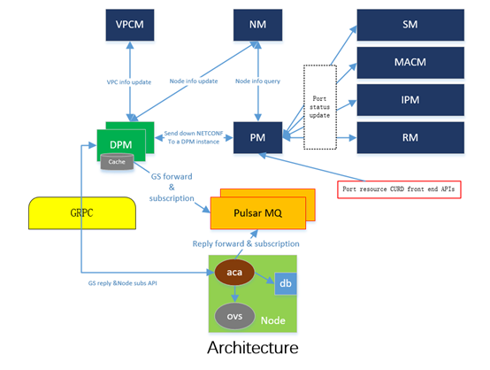
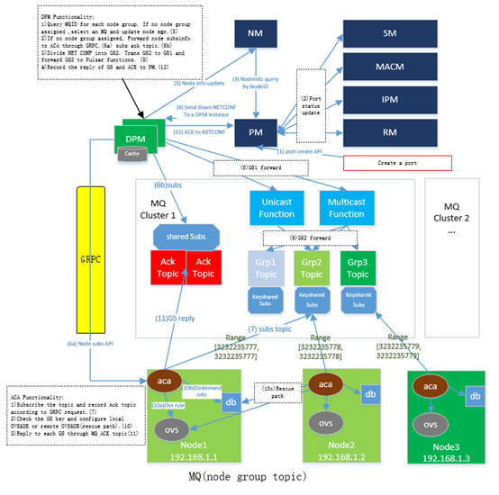
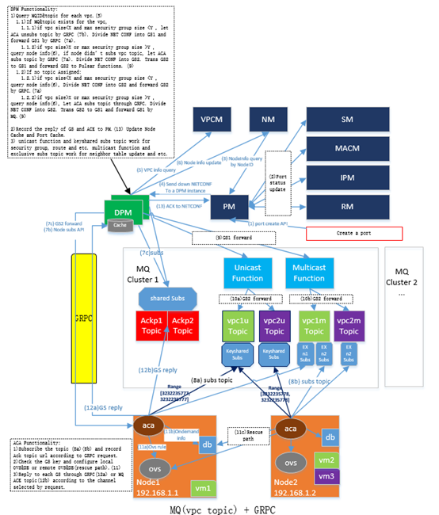
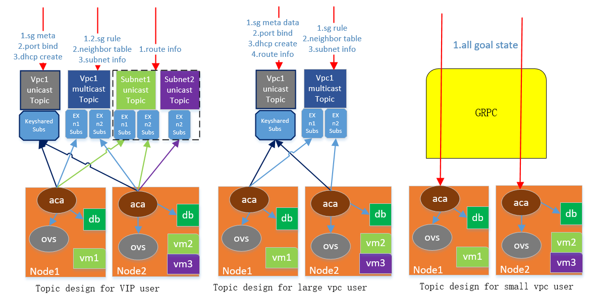
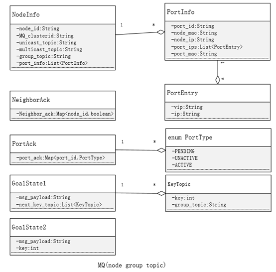
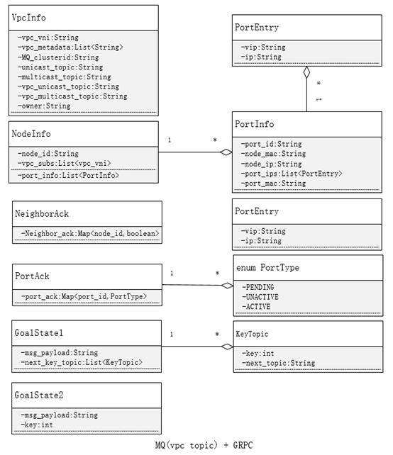

# Overview

Alcor provides messaging services for controller and agent communication. Messaging services consists of two channels. GRPC and pulsar MQ.

# System Requirements

1. DPM can split the network configuration into multiple goal states. DPM can appropriately choose MQ or GRPC channel to send goal state to the corresponding ACA.

2. When ACA configures goal state successfully, it returns success reply. When DPM receives replies of all goal states for a network configuration, it returns successful configuration to the caller

3. Messaging services can support 1000,000 data plane nodes.

4. Working together with other services including Node, Port, VPC, Data Plane managers.

5. Fast, reliable and scalable.

# Design

## Architecture

Fig. 1:architecture

## Design Option1: MQ (Node Group Topic)

Fig. 2: MQ Only (Node Group as a Topic)

## Design Option2: MQ (VPC Topic) + GRPC

Fig. 3: MQ&GRPC (VPC as a Topic) 

Fig. 4: Topic design

Alg. 1: Service Channel Selection Algorithm

## Data schema

Fig. 5: Data Schema for Option 1

Fig. 6: Data Schema for Option 2

Data schema

# References

[1] Apache Ignite: https://ignite.apache.org/

[2] Apache Pulsar:http://pulsar.apache.org/