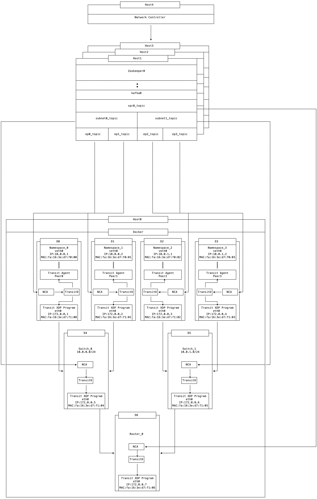

== End-to-End Test Setup

The end-to-end test scenario consists of one VPC and two subnets, and each subnet has two ports, respectively.
The test is deployed to five physical machine hosts with the following setup:

. Host 4 hosts Network VPC Controller application
* Rest web layer (REST CRUD APIs)
* Control logic
* Data persistence
* Goal state model to ensure fast network provisioning
* Reliable data delivery to message queue

. Hosts 1-3 host a three-node Kafka cluster
* Pub & sub model for fast and scalable message delivery
* Communicate with VPC Controller and Network Control Agent (NCA) with native Kafka protocol and Protobuf
* Each port node subscribes to its own topics

. Host 0 hosts 7 containers to simulate 8 physical hosts in a data center
* Container functionality
** D0-D3 host customer deployment (VM/container/serverless etc.) each of which is associated with a network port/endpoint
** D4 and D5 host transit switch instances for subnet 1 and subnet 2, respectively
** D6 hosts the VPC transit router instance
* Network Control Agent (NCA) deployed at each container
** Only entity to manage local host networking configuration
** Parse goal state configuration from Kafka
** Program transit daemon via local RPC calls
* Data plane component deployed at each container
** Transit Daemon to provide PRC apis
** Transit Agent attached to virtual interfaces
** Transit XDP program attached to physical interfaces

