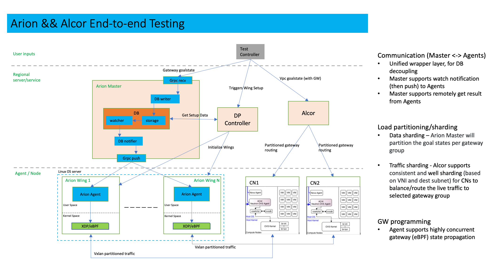

# End-to-end Test Configuration && Setup with Alcor and Arion

:revnumber: v1.0
:revdate: 2022 August 29
:author: Rio Zhu
:email: zzhu@futurewei.com

:toc: right

## Purpose

The purpose of this doc is to illustrate, explain and to give a guide to those who are interested in running the end-to-end test between Alcor Services (mainly the Network-Configuration-Manager), Alcor-Control-Agent (compute node agent), Arion (Control Plan and Data Plane).

## Test Setup and workflow

### Setup
Below is a typical setup for this end-to-end test:



There are three parts in this test setup:

1. Alcor services, mainly running Network Configuration Manager(NCM) and Ignite.
2. Compute nodes, mainly running Alcor-Control-Agent.
3. Arion Control Plane and Data Plane, including Arion Master(and its Hazelcast Database), Arion Agent and Arion DP Controller.

### Test Workflow

1. Test Controller reads its configuration file and generates metadata, such as how many VPCs, Subnets and ports(thus neighbors) to generate from this test.
2. Test Controller cleans up compute nodes, and then starts ACA on each compute node.
3. Test Controller creates the containers on compute nodes and assigns IPs/MACs for them.
4. Test Controller sends RESTful requests to Arion Master for the gateway cluster, Arion Wings and also VPCs.
5. Test Controller sends gRPC requests to Arion Master for the neighbors.
6. Test Controller triggers Arion DP Controller's setup process, which sets up the Arion Wings and other needed metadata.
7. Test Controller starts Arion Agent on each Arion Wing. Arion Agent GETs/WATCHes from the Hazelcast Database, retrieves neighbor information and programs each Arion Wing's local eBPF maps.
8. Test Controller GETs the gateway information from the Arion DP Controller, and assigns gateways to different subnets accordingly, so that different Arion Wings can handle traffics from different subnets(sharding). Test Controller also assembles the Goalstate with the metadata for the VPCs, Subnets, Ports, Neighbors and Gateways, and sends it to NCM, who will then send the information to each compute nodes. The compute nodes, after receiving the Goalstates, finishes its local setup.
9. Everything is ready, Test Controllers executes pings commands between different ports in the same subnet. The traffic will be directed to the desinated Arion Wing, based on the gateway rules we set up. The ping is supposed to go through.
10. This is the end of the Test Controller.

Example output for Test Controller will be provided below, at the `Test Controller` section.

## Configuration

This end-to-end test involves multiple components. It is important for users to configure each component correctly, in order to run this test successfully, get the expected result. In this section, instructions will be provided for each component.

We strive to give the best instructions, as detailed as possible, but it is very difficult to cover everything. If there are items that needs more explanation, please feel free to contact the Arion team, or create an issue on our Github repo.

### Alcor

For this test, alcor will be run in Docker containers. In order to do so, please follow these steps:

1. Clone the official Alcor repo from `https://github.com/futurewei-cloud/alcor.git`.
2. Build Alcor, following the https://github.com/futurewei-cloud/alcor/blob/master/docs/README.md#building-alcor[instructions here].
3. Get into the `scripts` folder by `cd alcor/scripts`.
4. Execute this command to stop and remove existing Alcor Docker conatiners, and build and run them: `./alcor_services.sh -o && ./alcor_services.sh -r && ./alcor_services.sh -b  && ./alcor_services.sh -a`. Before re-running this end-to-end test, you should restart these services by running this command: `./alcor_services.sh -o && ./alcor_services.sh -r   && ./alcor_services.sh -a`.

### Alcor-Control-Agent (ACA)

ACA will run on each compute nodes as the host agent. Compiling ACA takes quite some time, if you can make sure all the compute nodes have the same configuration (mainly ubuntu versions), you can compile it on one machine, then copy it to another machine and run it.

1. To compile ACA, please https://github.com/futurewei-cloud/alcor-control-agent/blob/master/src/README.md#run-the-build-script-to-set-up-the-build-container-and-compile-the-alcor-control-agent[follow this instruction], make sure you run the `aca-machine-init.sh` as `root`.

2. To run it, please run this command as root, inside ACA's directory: `nohup ./build/bin/AlcorControlAgent -d -a ${NCM_IP} -p ${NCM_PORT} > /tmp/aca_testing.log 2>&1`. Please fill in the correct NCM IP and Port, in order to connect each ACA with NCM. The NCM IP is the host IP of the machine that runs NCM, and the NCM port is 9016, unless you changed it. With the `nohup` at the beginning, the ACA will run in the background, so that even if your ssh session is disconnected, it should still run. The output of ACA will be directed to `/tmp/aca_testing.log`, as indicated in the command, feel free to change it if you need to.
3. After ACA starts, run `ps aux | grep Alcor` to make sure ACA is running, and run `ovs-ofctl dump-flows br-tun` to see if the default OVS rules exist, below is an example output of OVS rules, when ACA running fine in the background:
```
/home/user# ovs-ofctl dump-flows br-tun
Every 2.0s: ovs-ofctl dump-group-stats br-tun                                    fw0015534: Fri Aug 12 10:56:31 2022

NXST_GROUP reply (xid=0x6):
 cookie=0x0, duration=66456.986s, table=0, n_packets=83, n_bytes=4038, priority=1,in_port="patch-int" actions=resubmit(,2)
 cookie=0x0, duration=66456.986s, table=0, n_packets=8, n_bytes=672, priority=25,in_port="vxlan-generic" actions=resubmit(,4)
 cookie=0x0, duration=66456.986s, table=0, n_packets=0, n_bytes=0, priority=0 actions=NORMAL
 cookie=0x0, duration=66456.986s, table=2, n_packets=6, n_bytes=588, priority=25,icmp,in_port="patch-int",icmp_type=8 actions=resubmit(,52)
 cookie=0x0, duration=66456.986s, table=2, n_packets=0, n_bytes=0, priority=1,dl_dst=00:00:00:00:00:00/01:00:00:00:00:00 actions=resubmit(,20)
 cookie=0x0, duration=66456.986s, table=2, n_packets=77, n_bytes=3450, priority=1,dl_dst=01:00:00:00:00:00/01:00:00:00:00:00 actions=resubmit(,22)
 cookie=0x0, duration=66456.986s, table=20, n_packets=6, n_bytes=588, priority=1 actions=resubmit(,22)
 cookie=0x0, duration=66456.986s, table=52, n_packets=6, n_bytes=588, priority=1 actions=resubmit(,20)
```

Before running the next round of test, make sure you kill the current ACA process, cleanup the environment and restart ACA. Below is a convenient script that can kill the ACA process, remove all docker containers created from the last test, and cleanup the OVS bridges:
```
#! /bin/sh
#pkill -f AlcorControlAgent
kill -9 $(pidof AlcorControlAgent)
docker rm -f $(docker ps --filter "label=test=ACA" -aq)
sudo ovs-vsctl del-br br-tun
sudo ovs-vsctl del-br br-int
```

NOTE:
In the latest test controller workflow, compute node cleanup and ACA starting are included, so users don't need to do this manually.

### Arion Master and Hazelcast

Arion Master runs with a Hazelcast Database, and they run as standalone processes in this test. The following are the instructions to download, compile and run them:

#### Arion Master
1. Clone from Arion Master's https://github.com/futurewei-cloud/arion-master.git[Github repo].
2. Change the `arion.hazelcast.config.addresses`, in `arion_master/src/main/resources/application.properties`, to the IP of the machine you will run Hazelcast on. Make sure you can access that IP from the machine you run Arion Master on.
3. Compile it using command `mvn clean install`.
4. You should see Arion Master was successfully built.

#### Hazelcast
1. Download and setup Hazelcast from https://docs.hazelcast.com/hazelcast/5.1/getting-started/get-started-cli[this link], don't run it yet.
2. From the Arion Master repo, copy `arion-master/common/target/common-0.0.1-SNAPSHOT.jar`, which you should have after compiling Arion Master from the last section, to Hazelcast's library directory, located at `/usr/lib/hazelcast/lib`.
3. Start Hazelcast by running `sudo hz start`.
4. After Hazelcast is started and is running, start Arion Master by running command: `java -jar ./arionmaster-0.1.0-SNAPSHOT.jar --spring.config.location=/home/ubuntu/work/sharding_integration/arion-master/arion_master/src/main/resources/application.properties`.

Before starting a new round of test, make sure you shut down the current Arion Master and Hazecast, and restart them.

### Arion Agent

Arion Agent is the host Agent of each Arion Wing, like ACA is the host agent of each compute node. You can also consider building it on one of the Arion Wings, and then copy it to each wing, if you are positive that these wing machines share the same configuration. For this test, Arion Agent will be started by the Test Controller, so users don't run them directly. Please follow https://github.com/lfu-ps/arion-agent/blob/main/README.md[this instruction] to download and build Arion Agent.

NOTE:
In the latest test controller workflow, Arion Agent starting are included, so users don't need to do this manually.

### Arion DP Controller
The Arion DP Controller runs on a Kubernetes cluster, please refer to https://github.com/futurewei-cloud/arion-dp/blob/main/docs/getting_started.md[this page] in order to use it.

Notes:

- Before deploying it, please change the `hazelcast_ip_port` in `arion-dp/blob/main/src/mgmt/manager/project/api/settings.py` to the actual Hazelcast IP and port. The Hazelcast IP is the host IP of Hazelcast, and the port is `5701`.

- After deploying Arion DP Controller, please try to run `curl http://${ARION_DP_CONTROLLER_POD_IP}/nodes` to check the connectivity. For a freshly deployed Arion DP Controller, you should get the following:

```
$ curl http://${ARION_DP_CONTROLLER_POD_IP}/nodes
[]
```

Which is an empty list, as there's nothing there yet. If you cannot get any valid response, please run command `nohup kubectl port-forward svc/arion-manager --address ${DEPLOY_MACHINE_IP} 5000 >/dev/null </dev/null 2>&1 &`, to forward the Arion DP Controller's traffic to `${DEPLOY_MACHINE_IP}:5000`. After that, you should be able to connect to the Arion DP Controller:

```
$ curl http://${DEPLOY_MACHINE_IP}:5000/nodes
[]
```

- To monitor Arion DP Controller's activity, you can get into its kubernetes pod and monitor its access log and error log. Below are the instructions:
```
$ kubectl get pods
NAME                              READY   STATUS    RESTARTS         AGE
postgres-6fb9867c8d-g48zz         1/1     Running   17 (6h33m ago)   4d3h
arion-operator-7b4b8d7487-ncb47   1/1     Running   0                5h39m
arion-manager-69d46b769c-qbr9d    1/1     Running   0                5h39m
$ kubectl exec -it arion-manager-69d46b769c-qbr9d bash
kubectl exec [POD] [COMMAND] is DEPRECATED and will be removed in a future version. Use kubectl exec [POD] -- [COMMAND] instead.
root@arion-manager-69d46b769c-qbr9d:/opt/arion/manager# cd /var/log/gunicorn/
root@arion-manager-69d46b769c-qbr9d:/var/log/gunicorn# ls
access.log  error.log
root@arion-manager-69d46b769c-qbr9d:/var/log/gunicorn#
```
The `error.log` is very useful when debugging the DP Controller, as it prints logs on almost every step of the setup process.

- Before the next run, please re-deploy the Arion DP Controller.

### Test Controller

At last, after all other components are up and running, we configure the Test Controller, and run it to conduct our end-to-end test.

The Test Controller is located at `alcor/services/pseudo_controller`. To configure, compile and run it, please follow these steps:

1. `cd alcor/services/pseudo_controller`.
2. Modify the `src/main/resources/application.properties` all the way until `### Test Controller Alcor HTTP APIs Test Params ###`, those parameters are not used in this test so we don't need to pay attention to it.
3. Modify the  `src/main/resources/arion_data.json` according to your setup, mainly change the `NODE_data` section to the configuration of your Arion Wings.
4. Compile the Test Controller in its folder (`alcor/services/pseudo_controller`), using command `mvn clean install`.
5. Run the Test Controller using command ` mvn exec:java -D exec.mainClass=com.futurewei.alcor.pseudo_controller.pseudo_controller   -e`.

Note:
If you need to use the port forwarding for Arion DP Controller, please make sure you set the `dp_controller_use_port_forwarding` to `true`.

Attaching an example output below, for users' reference:

```
Inserts test controller output here, showing expected behavior of the e2e test.
```


Note:

- After running the Test Controller, you can also manually ping between the containers in the same subnet. Simply `ssh` one of the compute nodes, get into a container, and execute a ping command. Below is an example of it:

```
ubuntu@some_compute_node:~$ docker ps
CONTAINER ID   IMAGE          COMMAND   CREATED       STATUS       PORTS     NAMES
8d8e412336b2   wyue/perfpod   "sh"      6 hours ago   Up 6 hours             test210
15728dc8d3a9   wyue/perfpod   "sh"      6 hours ago   Up 6 hours             test209
f88223a7f350   wyue/perfpod   "sh"      6 hours ago   Up 6 hours             test208
00621a0c2159   wyue/perfpod   "sh"      6 hours ago   Up 6 hours             test207
a9feb9caf20b   wyue/perfpod   "sh"      6 hours ago   Up 6 hours             test206
7d722bb0c8c9   wyue/perfpod   "sh"      6 hours ago   Up 6 hours             test205
208c4a179f60   wyue/perfpod   "sh"      6 hours ago   Up 6 hours             test204
cc457c1dd3f2   wyue/perfpod   "sh"      6 hours ago   Up 6 hours             test203
7c919bb4456c   wyue/perfpod   "sh"      6 hours ago   Up 6 hours             test202
29e444416abf   wyue/perfpod   "sh"      6 hours ago   Up 6 hours             test201
b0096f1c5b70   wyue/perfpod   "sh"      6 hours ago   Up 6 hours             test200
e5ec60ca478e   wyue/perfpod   "sh"      6 hours ago   Up 6 hours             test199
5b1a85a719e3   wyue/perfpod   "sh"      6 hours ago   Up 6 hours             test198
b489d2533b74   wyue/perfpod   "sh"      6 hours ago   Up 6 hours             test197
6f0a095c867a   wyue/perfpod   "sh"      6 hours ago   Up 6 hours             test196
a3109d9d81a4   wyue/perfpod   "sh"      6 hours ago   Up 6 hours             test195
fe423370fb07   wyue/perfpod   "sh"      6 hours ago   Up 6 hours             test194
06b57b0c29da   wyue/perfpod   "sh"      6 hours ago   Up 6 hours             test193
c24b86b9056d   wyue/perfpod   "sh"      6 hours ago   Up 6 hours             test192
26c433913117   wyue/perfpod   "sh"      6 hours ago   Up 6 hours             test191
ebfe52703c99   wyue/perfpod   "sh"      6 hours ago   Up 6 hours             test190
ba2d53ed0c16   wyue/perfpod   "sh"      6 hours ago   Up 6 hours             test189
773090cd76bc   wyue/perfpod   "sh"      6 hours ago   Up 6 hours             test188
2235ddad5245   wyue/perfpod   "sh"      6 hours ago   Up 6 hours             test187
555edbe4e0bf   wyue/perfpod   "sh"      6 hours ago   Up 6 hours             test186
78dff864e08d   wyue/perfpod   "sh"      6 hours ago   Up 6 hours             test185
de824bf25691   wyue/perfpod   "sh"      6 hours ago   Up 6 hours             test184
c7312c6c15a5   wyue/perfpod   "sh"      6 hours ago   Up 6 hours             test183
0ba9947ea7ea   wyue/perfpod   "sh"      6 hours ago   Up 6 hours             test182
a4e53b58d1b5   wyue/perfpod   "sh"      6 hours ago   Up 6 hours             test181
ubuntu@fw0004747:~$ docker exec -it test181 bash
root@a4e53b58d1b5:/# ifconfig
eth0: flags=4163<UP,BROADCAST,RUNNING,MULTICAST>  mtu 1446
        inet 10.0.0.38  netmask 255.255.0.0  broadcast 0.0.0.0
        ether 00:00:00:00:00:38  txqueuelen 1000  (Ethernet)
        RX packets 537777  bytes 1025598698 (1.0 GB)
        RX errors 0  dropped 0  overruns 0  frame 0
        TX packets 258665  bytes 17530414 (17.5 MB)
        TX errors 0  dropped 0 overruns 0  carrier 0  collisions 0

lo: flags=73<UP,LOOPBACK,RUNNING>  mtu 65536
        inet 127.0.0.1  netmask 255.0.0.0
        loop  txqueuelen 1000  (Local Loopback)
        RX packets 0  bytes 0 (0.0 B)
        RX errors 0  dropped 0  overruns 0  frame 0
        TX packets 0  bytes 0 (0.0 B)
        TX errors 0  dropped 0 overruns 0  carrier 0  collisions 0

root@a4e53b58d1b5:/# ping -I 10.0.0.38 10.0.0.10
PING 10.0.0.10 (10.0.0.10) from 10.0.0.38 : 56(84) bytes of data.
64 bytes from 10.0.0.10: icmp_seq=1 ttl=64 time=4.36 ms
64 bytes from 10.0.0.10: icmp_seq=2 ttl=64 time=0.627 ms
64 bytes from 10.0.0.10: icmp_seq=3 ttl=64 time=0.490 ms
64 bytes from 10.0.0.10: icmp_seq=4 ttl=64 time=0.419 ms
^C
--- 10.0.0.10 ping statistics ---
4 packets transmitted, 4 received, 0% packet loss, time 3053ms
rtt min/avg/max/mdev = 0.419/1.473/4.357/1.666 ms
```

- Sometimes you wish to test with a physical network interface with a large traffic, but you only get a fraction of it's expected performance, you might want to check this page out: `https://github.com/futurewei-cloud/alcor-control-agent/wiki/Debugging-TCP-Connection-using-iperf3.`.


## Summary

This document introduces the end-to-end test with Alcor and Arion, it includes multiple components and requires many steps to set it up and get it running. We provided steps on how to install and run each component. If you are not clear about any steps, please contact our team, or open an issue on our Github repo. We thank you for spending time and effort reading this documentation, and running this test.