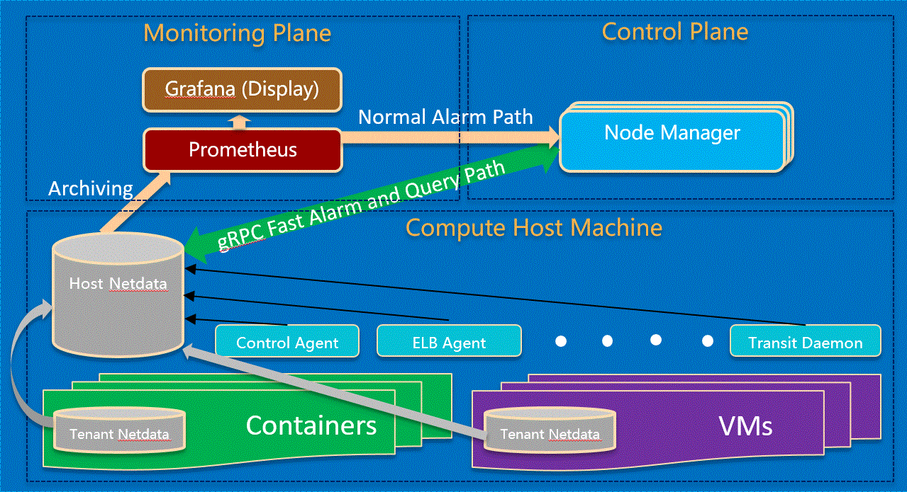

= System Monitoring and Failure Detection
:toc: right

[width="100%",options="header"]
|====================
|Title|Authors|Version
|System Monitoring and Failure Detection|@er1cthe0ne|0.1
|====================

// == Introduction

// TBD...

== Architecture

The following diagram illustrates the architecture of the monitoring plane. It also outline the communication with Control plane and Compute Host Machine.

== Background

=== Netdata

"Netdata is distributed, real-time, performance and health monitoring for systems and applications. It is a highly optimized monitoring agent you install on all your systems and containers.

Netdata provides unparalleled insights, in real-time, of everything happening on the systems it runs (including web servers, databases, applications), using highly interactive web dashboards. It can run autonomously, without any third party components, or it can be integrated to existing monitoring tool chains (Prometheus, Graphite, OpenTSDB, Kafka, Grafana, etc).

Netdata is fast and efficient, designed to permanently run on all systems (physical & virtual servers, containers, IoT devices), without disrupting their core function.

Netdata is free, open-source software and it currently runs on Linux, FreeBSD, and MacOS." <<Netdata>>

Windows support is on the roadmap and not yet available.

=== Prometheus

"Prometheus is an open-source systems monitoring and alerting toolkit originally built at SoundCloud. Since its inception in 2012, many companies and organizations have adopted Prometheus, and the project has a very active developer and user community. It is now a standalone open source project and maintained independently of any company. To emphasize this, and to clarify the project's governance structure, Prometheus joined the Cloud Native Computing Foundation in 2016 as the second hosted project, after Kubernetes.

Prometheus's main features are:

* a multi-dimensional data model with time series data identified by metric name and key/value pairs
* PromQL, a flexible query language to leverage this dimensionality
* no reliance on distributed storage; single server nodes are autonomous
* time series collection happens via a pull model over HTTP
* pushing time series is supported via an intermediary gateway
* targets are discovered via service discovery or static configuration
* multiple modes of graphing and dashboarding support" <<Prometheus>>

=== Grafana

"Grafana is an open source metric analytics & visualization suite. It is most commonly used for visualizing time series data for infrastructure and application analytics but many use it in other domains including industrial sensors, home automation, weather, and process control." <<Grafana>>

See https://grafana.com/grafana/ for some beautiful Grafana diagram examples.

== High-Level Design

The high-level design is to have a decentralized data collection and processing engine, named Host Netdata, running on each compute host <<Netdata>>. The Host Netdata is responsible of:

* Heartbeating with node manager
* Collecting all the interesting local metrix
* Analyzing local data quickly to detect failure (like ACA went down)
* Raising alarm to node manager on definite problems
* Digesting and archiving data into prometheus

=== Host Agents and Netdata Health

As Host Netdata becomes the decentralized monitoring engine which can efficiently collect, process data and provide clear actionable notification to node manager. It can also becomes the single point of failure on monitoring plane and block all host data processing when Host Netdata goes offline or when host machine goes down. A liveliness guarantee system is needed. There will be multiple heartbeat paths:

1. Host Netdata will monitor all Host Agents heartbeat very second, notify node manager directly through gRPC if there is issue with one or more Host Agent.
2. Host Netdata heartbeat to node manager freqently (e.g. every a few seconds) through gRPC or Kafka.
3. Host Netdata archive heartbeat data to prometheus (e.g. every 5 seconds) for longer term storage and viewing in Grafana.

NOTE: 2 and 3 above will contain both heartbeat data from Host Netdata, and heartbeat data from all Host Agents (e.g. ACA, ELB, Compute, etc...) in bitmap format to minimize data and storage size.

=== Host Machine Health

Host Netdata will collect host machine networking health data like physical NIC bandwidth, and host network stack health and utilization.

Host Netdata will perform quick data analysis for obvious issue like physical NIC bandwidth maxed out. It will notifiy node manager on clear and actionable alarms. All the local metrix will be digested (e.g. sum, average) and archive to prometheus.

Host Netdata can also collect other host machine health including CPU and memory usage, that is not limited to the scope of networking.

=== Data-Plane Health

Host Netdata will also monitor the Data-Plane health. For Mizar data plane, a new Netdata plugin will be used to pull data from Transit daemon for transit switch and transit router metrix. For obvious issue like transit switch is overloaded, it will notify VPC manager directly through gRPC to correct the issue. All remaining data will be archived to prometheus for deeper analysis.

=== Tenant VMs/Containers Health

Tenant VMs/Containers Health will be monitored in two ways:

1. The VM runtime or container runtime can provide information or hooks to expose VM/container status like state (stopped/running/paused) and device status (NIC disconnected/connection/paused). This is linux runtime dependent and does not require customer opt-in. This data can be streamed to host netdata without customer involvement.

2. Customer can opt-into a 3rd party monitoring solution or opt into our Netdata solution. Once they enable Netdata for VM/container monitoring, the tenant Netdata will stream data to host netdata for quick analysis and archive to prometheus.

== Open Questions

* What kinds of metrix to collect on the host machine?
* What is the amount and frequency of data (in MB) to be collected and stored on Host Netdata?
* What is the amount and frequency of data (in MB) to be sent to Prometheus?
* Need to figure out how to collect health data from VM/Container runtime.

== Proposed Changes

The System Monitoring and Failure Detection system would requires the following changes:

[width="100%",options="header"]
|====================
|Index|Feature Description|Priority|Note
|1|Netdata research and investigation |P0|
|2|Netdata implementation .3+^.^|P0|
|2.1|work item 1|
|2.2|work item 2|
|3|Update Node Manager .3+^.^|P0|
|3.1|work item 1|
|3.2|work item 2|
|4|E2E latency measurement for monitoring plane|P0|
|5|Performance test to get scalability limit for monitoring data|P1|
|====================

[bibliography]
== References

- [[[Netdata,1]]] NetData: https://docs.netdata.cloud/docs/what-is-netdata/

- [[[Prometheus,2]]] Prometheus: https://prometheus.io/docs/introduction/overview/

- [[[Grafana,3]]] Grafana: https://grafana.com/docs/v4.3/
