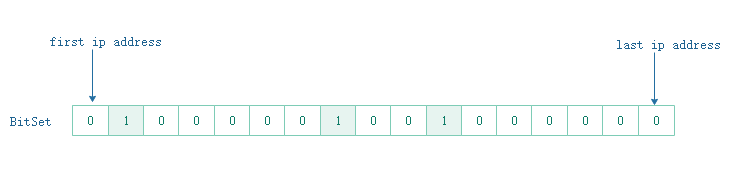
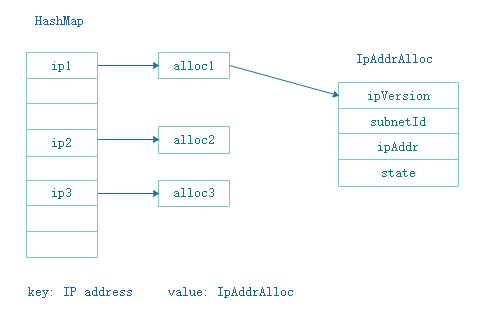

= Private IP Manager Design Specification
Piaoping Chen <chenpiaoping@yeah.net>, Liguang Xie <lxie@futurewei.com>
v0.1, 2020-04-08
:toc: right

== Overview

Private IP manager is an Alcor microservice which manages the lifecycle of all Private IP addresses.
Its responsibilities include but not limited to, allocating a unique IP address for a given port,
releasing the IP address when not needed, and onboarding a IP range of a subnet.
It interacts with Subnet Manager and Port Manager to allocate IP addresses for gateway ports and customer ports.

== Service Requirements

[arabic]
. Allocate private IP address for all the ports, e.g., (Subnet 1, Port 1) -> IP1.
. Release (port, IP) association when a port is released, or a port allocates a new IP.
. Guarantee uniqueness of IP address in a subnet scope.
. Fall back mechanism if there is a conflict among IP addresses.
. Working together with other services including subnet manager and port manager.
. Concurrency control mechanism should be provided to process multiple concurrent IP allocation requests.
. Support allocation and release of a list of IP addresses.

== REST APIs

=== API Snapshot

[width="100%",cols="22%,12%,50%,17%"]
|===
|*API Name* |*Method* |*Request*|*Response*

|Verify IP State
|GET
|/ips/{ip_version}/{range_id}/{ip}
|ip state
<<IP_Get,[sample]>>

|List all allocated IP State
|GET
|/ips/{ip_version}/{range_id}
|ip state list
<<IP_List,[sample]>>

|Create IP State
|POST
|/ips
|ip state
<<IP_Post,[sample]>>

|Create IP State Bulk
|POST
|/ips/bulk
|ip state list
<<IP_Post_Bulk,[sample]>>

|Activate IP Address
|PUT
|/ips
|ip state
<<IP_Put1,[sample]>>

|Activate IP Address Bulk
|PUT
|/ips/bulk
|ip state list
<<IP_Put1_Bulk,[sample]>>

|Deactivate IP Address
|PUT
|/ips
|ip state
<<IP_Put2,[sample]>>

|Deactivate IP Address Bulk
|PUT
|/ips/bulk
|ip state list
<<IP_Put2_Bulk,[sample]>>

|Release IP State
|DELETE
|/ips/{ip_version}/{range_id}/{ip}
|ip state
<<IP_Delete,[sample]>>

|Release IP State Bulk
|DELETE
|/ips/bulk
|ip state list
<<IP_Delete_Bulk,[sample]>>

|Create IP Range
|POST
|/ips/range
|ip range
<<IP_Range_Post,[sample]>>

|Get IP Range
|GET
|/ips/range/{range_id}
|ip range
<<IP_Range_Get,[sample]>>

|List all IP Range
|GET
|/ips/range
|ip range list
<<IP_Range_List,[sample]>>
|===

=== API Specification

anchor:IP_Get[]
**(1) Get/Verify IP state by IP address**

* Method: `GET`

* Request: `/ips/{ip_version}/{range_id}/{ip}`

* Request Parameter: `@PathVariable int ipVersion, @PathVariable String rangeId, @PathVariable String ip`

* Response: ip state
* Normal response codes: 200
* Error response codes: 400, 412, 500

* Example

....
Request:
http://127.0.0.1:8080/ips/4/174ac5e4-7fb5-11ea-8cc4-000c29f4bc8b/10.10.10.1

Response:
{
	"ip_version": 4, 
    "range_id": "174ac5e4-7fb5-11ea-8cc4-000c29f4bc8b",
    "ip": "10.10.10.1",
    “state” “activated”
}

....
anchor:IP_List[]
**(2) Get all allocated IP state**

* Method: `GET`

* Request: `/ips/{ip_version}/{range_id}`

* Request Parameter: `@PathVariable int ipVersion, @PathVariable String rangeId`

* Response: ip state list
* Normal response codes: 200
* Error response codes: 400, 412, 500

* Example

....
Request:
http://127.0.0.1:8080/ips/4/174ac5e4-7fb5-11ea-8cc4-000c29f4bc8b

Response:
[
  {
  	"ip_version": 4, 
    "range_id": "174ac5e4-7fb5-11ea-8cc4-000c29f4bc8b",
    "ip": "11.11.11.76",
    "state": "activated"
  },
  {
  	"ip_version": 4, 
    "range_id": "174ac5e4-7fb5-11ea-8cc4-000c29f4bc8b",
    "ip": "11.11.11.67",
    "state": "activated"
  },
  {
  	"ip_version": 4, 
    "range_id": "174ac5e4-7fb5-11ea-8cc4-000c29f4bc8b",
    "ip": "11.11.11.156",
    "state": "activated"
  }
]

....
anchor:IP_Post[]
**(3) Allocate IP Address for Port**

* Method: `POST`

* Request: `/ips`

* Request Parameter:

* Response: `ip state`

* Normal response codes: 201

* Error response codes: 400, 409, 412, 500, 503

* Example
....
Request:
http://127.0.0.1:8080/ips

Body:
{
	"ip_version": 4, 
    "range_id": "174ac5e4-7fb5-11ea-8cc4-000c29f4bc8b",
    "ip": “null”,
    “state”: “null”
}

Response:
{
	"ip_version": 4, 
    "range_id": "174ac5e4-7fb5-11ea-8cc4-000c29f4bc8b",
    "ip": "10.10.10.1",
    “state” “activated”
}

....
anchor:IP_Post_Bulk[]
**(4) Allocate multiple IP Addresses for Port**

* Method: `POST`

* Request: `/ips/bulk`

* Request Parameter:

* Response: `ip state list`

* Normal response codes: 201

* Error response codes: 400, 409, 412, 500, 503

* Example
....
Request:
http://127.0.0.1:8080/ips/bulk

Body:
{
    "ip_requests":
    [
        {
			"ip_version": 4, 
			"range_id":"174ac5e4-7fb5-11ea-8cc4-000c29f4bc8b",
			"ip": null,
			"state": null
        },
        {
			"ip_version": 4, 
			"range_id":"174ac5e4-7fb5-11ea-8cc4-000c29f4bc8b",
			"ip": null,
			"state": null
        },
        {
			"ip_version": 4, 
			"range_id":"174ac5e4-7fb5-11ea-8cc4-000c29f4bc8b",
			"ip": null,
			"state": null
        }
    ]
}

Response:
{
  "ip_requests": [
    {
		"ip_version": 4, 
		"range_id": "174ac5e4-7fb5-11ea-8cc4-000c29f4bc8b",
		"ip": "11.11.11.28",
		"state": "activated"
    },
    {
		"ip_version": 4, 
		"range_id": "174ac5e4-7fb5-11ea-8cc4-000c29f4bc8b",
		"ip": "11.11.11.29",
		"state": "activated"
    },
    {
		"ip_version": 4, 
		"range_id": "174ac5e4-7fb5-11ea-8cc4-000c29f4bc8b",
		"ip": "11.11.11.24",
		"state": "activated"
    }
  ]
}

....
anchor:IP_Put1[]
**(5) Activate IP Address**

* Method: `PUT`

* Request: `/ips`

* Request Parameter: 

* Response: `ip state`

* Normal response codes: 200

* Error response codes: 400, 412, 500

* Example
....
Request:
http://127.0.0.1:8080/ips/

Body:
{
	"ip_version": 4, 
    "range_id": "174ac5e4-7fb5-11ea-8cc4-000c29f4bc8b",
    "ip": "10.10.10.1",
    “state” “activated”
}

Response:
{
	"ip_version": 4, 
    "range_id": "174ac5e4-7fb5-11ea-8cc4-000c29f4bc8b",
    "ip": "10.10.10.1",
    “state” “activated”
}

....
anchor:IP_Put1_Bulk[]
**(6) Activate multiple IP Addresses**

* Method: `PUT`

* Request: `/ips/bulk`

* Request Parameter: 

* Response: `ip state list`

* Normal response codes: 200

* Error response codes: 400, 412, 500

* Example
....
Request:
http://127.0.0.1:8080/ips/bulk

Body:
{
  "ip_requests": [
    {
	  "ip_version": 4, 
      "range_id": "174ac5e4-7fb5-11ea-8cc4-000c29f4bc8b",
      "ip": "11.11.11.28",
      "state": "activated"
    },
    {
	  "ip_version": 4, 
      "range_id": "174ac5e4-7fb5-11ea-8cc4-000c29f4bc8b",
      "ip": "11.11.11.29",
      "state": "activated"
    },
    {
	  "ip_version": 4, 
      "range_id": "174ac5e4-7fb5-11ea-8cc4-000c29f4bc8b",
      "ip": "11.11.11.24",
      "state": "activated"
    }
  ]
}

Response:
{
  "ip_requests": [
    {
	  "ip_version": 4, 
      "range_id": "174ac5e4-7fb5-11ea-8cc4-000c29f4bc8b",
      "ip": "11.11.11.28",
      "state": "activated"
    },
    {
	  "ip_version": 4, 
      "range_id": "174ac5e4-7fb5-11ea-8cc4-000c29f4bc8b",
      "ip": "11.11.11.29",
      "state": "activated"
    },
    {
	  "ip_version": 4, 
      "range_id": "174ac5e4-7fb5-11ea-8cc4-000c29f4bc8b",
      "ip": "11.11.11.24",
      "state": "activated"
    }
  ]
}

....
anchor:IP_Put2[]
**(7) Deactivate IP Address**

* Method: `PUT`

* Request: `/ips`

* Request Parameter:

* Response: `ip state`

* Normal response codes: 200

* Error response codes: 400, 412, 500

* Example
....
Request:
http://127.0.0.1:8080/ips

Body:
{
    "ip_version": 4, 
    "range_id": "174ac5e4-7fb5-11ea-8cc4-000c29f4bc8b",
    "ip": "10.10.10.1",
    “state” “deactivated”
}

Response:
{
    "ip_version": 4, 
    "range_id": "174ac5e4-7fb5-11ea-8cc4-000c29f4bc8b",
    "ip": "10.10.10.1",
    “state” “deactivated”
}

....
anchor:IP_Put2_Bulk[]
**(8) Deactivate multiple IP Addresses**

* Method: `PUT`

* Request: `/ips/bulk`

* Request Parameter:

* Response: `ip state list`

* Normal response codes: 200

* Error response codes: 400, 412, 500

* Example
....
Request:
http://127.0.0.1:8080/ips/bulk

Body:
{
  "ip_requests": [
    {
	  "ip_version": 4, 
      "range_id": "174ac5e4-7fb5-11ea-8cc4-000c29f4bc8b",
      "ip": "11.11.11.28",
      "state": "deactivated"
    },
    {
	  "ip_version": 4, 
      "range_id": "174ac5e4-7fb5-11ea-8cc4-000c29f4bc8b",
      "ip": "11.11.11.29",
      "state": "deactivated"
    },
    {
	  "ip_version": 4, 
      "range_id": "174ac5e4-7fb5-11ea-8cc4-000c29f4bc8b",
      "ip": "11.11.11.24",
      "state": "deactivated"
    }
  ]
}

Response:
{
  "ip_requests": [
    {
	  "ip_version": 4, 
      "range_id": "174ac5e4-7fb5-11ea-8cc4-000c29f4bc8b",
      "ip": "11.11.11.28",
      "state": "deactivated"
    },
    {
	  "ip_version": 4, 
      "range_id": "174ac5e4-7fb5-11ea-8cc4-000c29f4bc8b",
      "ip": "11.11.11.29",
      "state": "deactivated"
    },
    {
	  "ip_version": 4, 
      "range_id": "174ac5e4-7fb5-11ea-8cc4-000c29f4bc8b",
      "ip": "11.11.11.24",
      "state": "deactivated"
    }
  ]
}

....
anchor:IP_Delete[]
**(9) Delete/Release IP Address**

* Method: `DELETE`

* Request: `/ips/{ip_version}/{range_id}/{ip}`

* Request Parameter: `@PathVariable int ipVersion, @PathVariable String rangeId, @PathVariable String ip`

* Response: `ip state`

* Normal response codes: 200

* Error response codes: 400, 412, 500

* Example
....
Request:
http://127.0.0.1:8080/ips/4/174ac5e4-7fb5-11ea-8cc4-000c29f4bc8b/10.10.10.1

Response:
{
    "ip_version": 4, 
    "range_id": "174ac5e4-7fb5-11ea-8cc4-000c29f4bc8b",
    "ip": "10.10.10.1",
    “state” “free”
}

....
anchor:IP_Delete_Bulk[]
**(10) Delete/Release multiple IP Addresses**

* Method: `DELETE`

* Request: `/ips/bulk`

* Request Parameter:

* Response: `ip state list`

* Normal response codes: 200

* Error response codes: 400, 412, 500

* Example
....
Request:
http://127.0.0.1:8080/ips/bulk

Body:
{
  "ip_requests": [
    {
	  "ip_version": 4, 
      "range_id": "174ac5e4-7fb5-11ea-8cc4-000c29f4bc8b",
      "ip": "11.11.11.28",
      "state": "activated"
    },
    {
	  "ip_version": 4, 
      "range_id": "174ac5e4-7fb5-11ea-8cc4-000c29f4bc8b",
      "ip": "11.11.11.29",
      "state": "activated"
    },
    {
	  "ip_version": 4, 
      "range_id": "174ac5e4-7fb5-11ea-8cc4-000c29f4bc8b",
      "ip": "11.11.11.24",
      "state": "activated"
    }
  ]
}

Response:
{
  "ip_requests": [
    {
	  "ip_version": 4, 
      "range_id": "174ac5e4-7fb5-11ea-8cc4-000c29f4bc8b",
      "ip": "11.11.11.28",
      "state": "free"
    },
    {
	  "ip_version": 4, 
      "range_id": "174ac5e4-7fb5-11ea-8cc4-000c29f4bc8b",
      "ip": "11.11.11.29",
      "state": "free"
    },
    {
	  "ip_version": 4, 
      "range_id": "174ac5e4-7fb5-11ea-8cc4-000c29f4bc8b",
      "ip": "11.11.11.24",
      "state": "free"
    }
  ]
}

....

anchor:IP_Range_Post[]
**(11) Onboard IP Range**

* Method: `POST`
* Request: `/ips/range`
* Request Parameter:
* Response: `ip range`
* Normal response codes: 201
* Error response codes: 400, 409, 412, 500, 503

* Example
....
Request:
http://127.0.0.1:8080/ips/range

Body:
{
    "ip_version": 4, 
    "id": "174ac5e4-7fb5-11ea-8cc4-000c29f4bc8b",
	"subnet_id": "174ac5e4-7fb5-11ea-8cc4-000c29f4bcab",
    "first_ip": "10.10.10.1",
    “last_ip” “10.10.10.254”
}

Response:
{
    "ip_version": 4, 
    "id": "174ac5e4-7fb5-11ea-8cc4-000c29f4bc8b",
	"subnet_id": "174ac5e4-7fb5-11ea-8cc4-000c29f4bcab",
    "first_ip": "10.10.10.1",
    “last_ip” “10.10.10.254”,
	"used_ips": 0,
    "total_ips": 254
}

....
anchor:IP_Range_Put[]
**(12) Remove IP Range by Range Id**

* Method: `PUT`
* Request: `/ips/range/{range_id}`
* Request Parameter:
* Response: `ip range`
* Normal response codes: 200
* Error response codes: 400, 412, 500

* Example
....
Request:
Request:
http://127.0.0.1:8080/ips/range/174ac5e4-7fb5-11ea-8cc4-000c29f4bc8b

Response:
{
    "ip_version": 4, 
    "id": "174ac5e4-7fb5-11ea-8cc4-000c29f4bc8b",
	"subnet_id": "174ac5e4-7fb5-11ea-8cc4-000c29f4bcab",
    "first_ip": "10.10.10.1",
    “last_ip” “10.10.10.254”,
	"used_ips": 0,
    "total_ips": 254
}

....
anchor:IP_Range_Get[]
**(13) Get IP range by Range Id**

* Method: `GET`

* Request: `/ips/range`

* Request Parameter: `@PathVariable String rangeId`

* Response: ip range
* Normal response codes: 200
* Error response codes: 400, 412, 500

* Example

....
Request:
http://127.0.0.1:8080/ips/range/174ac5e4-7fb5-11ea-8cc4-000c29f4bc8b

Response:
{
    "ip_version": 4, 
    "id": "174ac5e4-7fb5-11ea-8cc4-000c29f4bc8b",
	"subnet_id": "174ac5e4-7fb5-11ea-8cc4-000c29f4bcab",
    "first_ip": "10.10.10.1",
    “last_ip” “10.10.10.254”,
	"used_ips": 0,
    "total_ips": 254
}

....
anchor:IP_Range_List[]
**(14) Get all ranges**

* Method: `GET`

* Request: `/ips/range`

* Request Parameter: 

* Response: ip range list
* Normal response codes: 200
* Error response codes: 400, 412, 500

* Example

....
Request:
http://127.0.0.1:8080/ips/range

Response:
[
  {
    "ip_version": 4, 
    "id": "174ac5e4-7fb5-11ea-8cc4-000c29f4bc8b",
	"subnet_id": "174ac5e4-7fb5-11ea-8cc4-000c29f4bcab",
    "first_ip": "11.11.11.1",
    "last_ip": "11.11.11.254"
	"used_ips": 0,
    "total_ips": 5	
  },
  {
    "ip_version": 4, 
    "id": "9db428a0-7fbf-11ea-8cc4-000c29f4bc8b",
	"subnet_id": "174ac5e4-7fb5-11ea-8cc4-000c29f4bcac",
    "first_ip": "12.12.12.1",
    "last_ip": "12.12.12.254"
	"used_ips": 0,
    "total_ips": 5	
  }
]

....
== Database Data Schema

=== IP Address State
One IP address falls into one of three states:

[width="100%",cols="30%,70%"]
|===
|*State* |*Details*

|Activated
|IP address is allocated to a port AND it is in use. This is default.

|Deactivated
|IP address is allocated to a port AND it is NOT in use.

|Free
|IP address is NOT allocated to a port yet.
|===

== Concurrency Handling

There are multiple instances of private_ip_manager, and multiple instances may assign ip addresses from the same ip range at the same time. In order to ensure the uniqueness of the assigned ip addresses, we use transaction to ensure that the process of ip address allocation is mutually exclusive. The following is a code snippet for assigning an ip address:
....
public synchronized String allocateIpAddr(String rangeId) throws Exception {
	String ipAddr;

	try (Transaction tx = ipAddrRangeCache.getTransaction().start()) {
		IpAddrRange ipAddrRange = ipAddrRangeCache.get(rangeId);
		if (ipAddrRange == null) {
			throw new RangeNotFoundException();
		}

		ipAddr = ipAddrRange.allocate();
		ipAddrRangeCache.put(ipAddrRange.getRangeId(), ipAddrRange);

		tx.commit();
	}

	return ipAddr;
}
....
== IP allocation algorithm

An ip range is actually a subnet, that is, a contiguous ip address space. Two subnet may come from the same vpc, or from different vpc. Since the address space between different vpc may overlap, so the address space of the subnet may overlap too. However, private_ip_manager does not intend to care about which vpc the subnet belongs to, just do a good job of ip address management and allocation. So private_ip_manager simply believes that the address space between ip range can overlap, no need to care which tenant or vpc the ip range belongs to, and no need to store tenant and vpc related information (this information should be stored in other microservices). The addresses in each ip range include assigned ip addresses and free ip addresses, and each ip address has three states: activated, deactivated, and free. The status of no assigned ip addresses is free, the status of each assigned ip address may be activated or deactivated, in order to efficiently manage assigned and no assigned ip addresses and reduce memory usage, BitSet is used to record whether each ip address in an ip range has been assigned. 0 indicates that it is not assigned, 1 indicates that it has been allocated.

When assigning an ip address, start from the first location of BitSet to find a free location, add the value of firtIp as the value of the destination ip address, and then convert it to String type ip address.
Similarly, when deleting an ip address, the String type ip address is first converted to a numeric value, substract the value of firstIp, find the location of the ip address in BitSet according to the subtraction result, and finally set the value of this location to 0.

For the assigned ip address, it is necessary to record whether it is activated or deactivated state. Therefore, the assigned ip address is described by the IpAddrAlloc class, and the state member of the IpAddrAlloc records the state of the assigned ip address, Each assigned ip address will be added to the Map < String, IpAddrAlloc > allocated, In this way, the Get request can quickly find the assigned ip address, and the activate or deactivate request can quickly modify its state.

