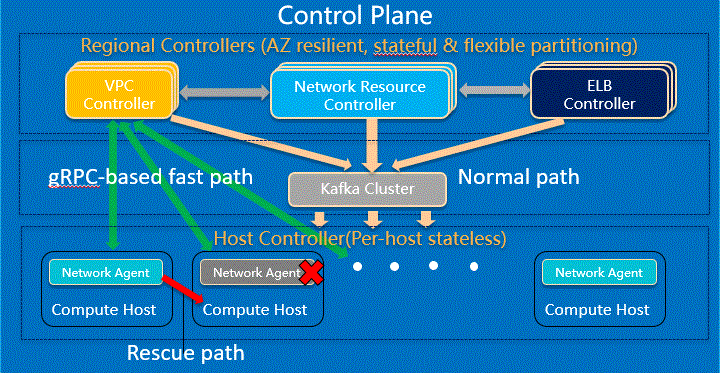

= Control Plane Rescue Path [DRAFT]

Skip local crashed agent and call neighbor agent to pass network configuration

[width="100%",options="header"]
|====================
|Title|Authors|Version
|Control Plane Fast Path|@er1cthe0ne|1.0
|====================

== Introduction

A highly available network control plane is also critical to to public cloud offering. As the user base of a cloud provide growing at the rate of 10X in just a few years. The network control plane load faces exponential grow which requires innovative architecture and revolutionary design to support the scale. As the line of code increases to support the complex requirements and customer features, we need a fail safe network control path to handle software failures so that the network control plane can continue function as of nothing bad had happened.

== Architecture

The following diagram illustrates the architecture of the network control plane rescue path, 
and how it communicate to peer compute host to help with network configuration and date plane programming:

=== Design

Even if the rate of sofware failure is 1 out of 1 million, the failure would happen everyday in a large scale public cloud offering.

the network configuration tasks were not only work locally fast, it will also work well remotely with minimal cost.

how to network configuration

how to program transit

Tranparenecy to customer.

== Updated Contract between Controller and Agent

TargetHostIP will be added to the GoalState protobuf message. "LocalHost" string will be used for network configuration in the local compute host machine, which represent most of the usage. TargetHostIP will be set to remote compute host IP address, for the rescue path operation when needed.

*src/schema/proto3/goalstate.proto*

[source,java]
------------------------------------------------------------
syntax = "proto3";

package aliothcontroller;

option java_package = "com.futurewei.alioth.controller.schema";

import "vpc.proto";
import "subnet.proto";
import "port.proto";
import "securitygroup.proto";

message GoalState {
   string TargetHostIP = 1;
   repeated VpcState vpc_states = 2;
   repeated SubnetState subnet_states = 3;
   repeated PortState port_states = 4;
   repeated SecurityGroupState security_group_states = 5;
}
------------------------------------------------------------

//=== Error Handling

//response back to network controller using gsReply message

== Proposed Changes

The control plane rescue path would requires the following changes:

[width="100%",options="header"]
|====================
|Index|Feature Description|Priority|Note
|1|An additional field (TargetHostIP) in GoalState message to specify either "LocalHost" or remote host IP|P0|
|2|Update Control Agent logic to use TargetHostIP .3+^.^|P0|
|2.1|Control Agents to perform network configuration in Remote Host|
|2.2|Control Agents to perform dataplace programming in Remote Host|
|3|Update Network Controllor .3+^.^|P0|
|3.1|work item 1|
|3.2|work item 2|
|4|E2E latency measurement for rescue path|P0|
|5|Performance test to get scalability limit for remote network configuration|P1|
|====================
