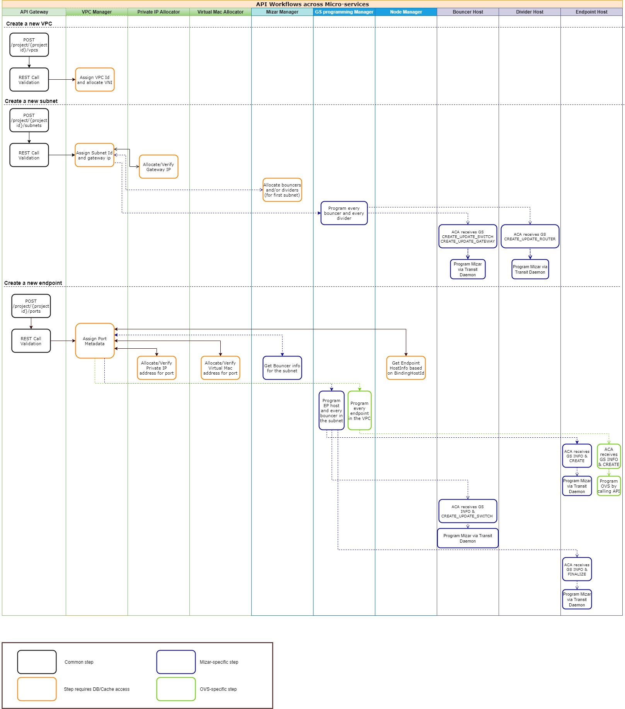
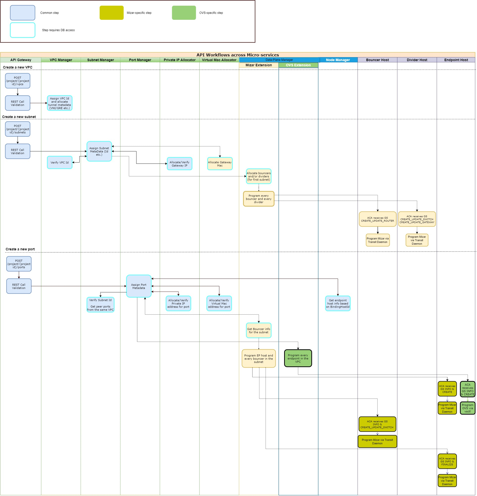

= Key System Flows

Option 1:

Option 2:

== VPC Creation

== Subnet Creation/Update

== Port Creation/Update

== VPC Deletion

== Subnet Deletion

== Port Deletion

== Reference: Neutron High Level Flow

Neutron uses RPC over message queue for Neutron server and compute host agent communication. As more features are added to neutron, more RPC calls are added support feature like Security Group, DVR, smartnic.

The communication channel is quite chatty, it involves at least 5 RPC calls to setup a new port on a compute host on a typical setup with security group and DVR:

. get_devices_details_list_and_failed_devices - agent calls neutron server to get detail on a newly discover port
. get_subnet_for_dvr - agent calls neutron server to get the subnet information on the new port
. get_ports_on_host_by_subnet - agent call neutron for a list of ports on the host to update DVR
. _handle_sg_rule_update - new security group for the newly created port
. update_device_list - agent inform neutron server the port binding is complete and port state is up

https://wiki.openstack.org/w/images/5/56/Router-add-interface-flow-that-triggers-different-Plugins-agents.png
