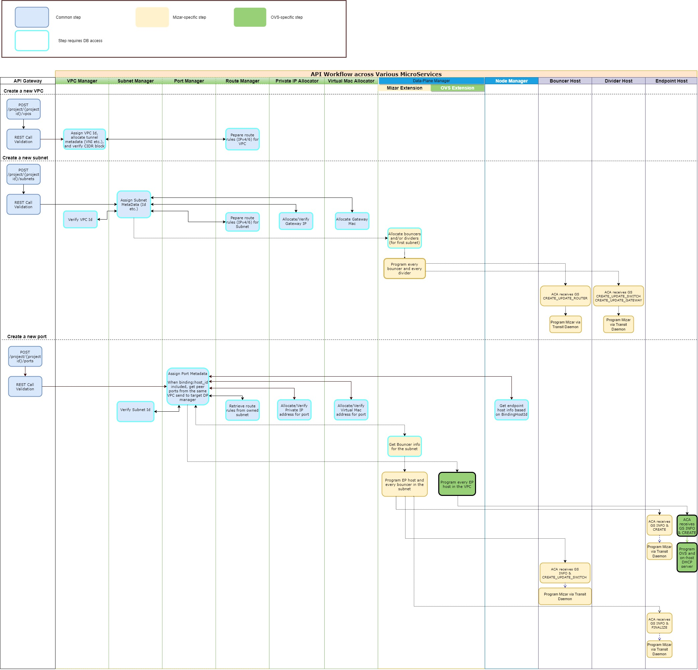

= Key System Flows

//Option 1:
//
//image::images/workflow_create.jpg["API Workflows of Creating VPC, subnet and port across various microservices", width=1024, link="images/workflow_create.JPG"]
//
//Option 2:
//
//image::images/Create_workflow_option2.jpg["API Workflows of Creating VPC, subnet and port across various microservices", width=1024, link="images/Create_workflow_option2.JPG"]

== VPC/Subnet/Port Workflow

These creation workflow involves multiple microservice types

. Customer Resource Management services, each managing a specific resource including VPC, subnet, port, route, IP and MAC
. Infrastructure services that are invisible to end-users including data-plane managers and node manager

=== Creation Workflow

=== Update Workflow

=== Deletion Workflow

== Gateway/Router Workflow

== Security Group and Network ACL Workflow

== Reference: Neutron High Level Flow

Neutron uses RPC over message queue for Neutron server and compute host agent communication. As more features are added to neutron, more RPC calls are added support feature like Security Group, DVR, smartnic.

The communication channel is quite chatty, it involves at least 5 RPC calls to setup a new port on a compute host on a typical setup with security group and DVR:

. get_devices_details_list_and_failed_devices - agent calls neutron server to get detail on a newly discover port
. get_subnet_for_dvr - agent calls neutron server to get the subnet information on the newly created port
. get_ports_on_host_by_subnet - agent call neutron server for a list of ports on the host to update DVR
. _handle_sg_rule_update - new security group programming for the newly created port
. update_device_list - agent inform neutron server the port binding is completed and port state is up

https://wiki.openstack.org/w/images/5/56/Router-add-interface-flow-that-triggers-different-Plugins-agents.png
